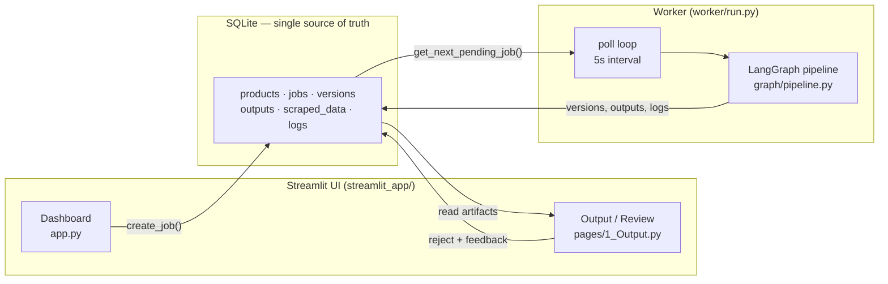
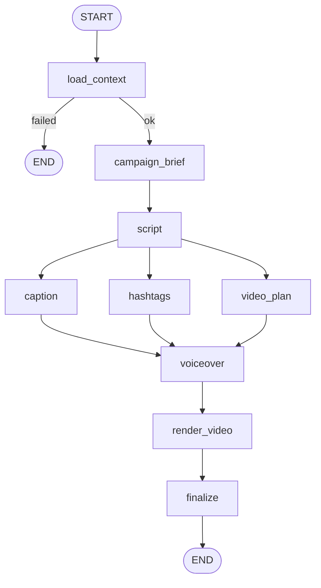
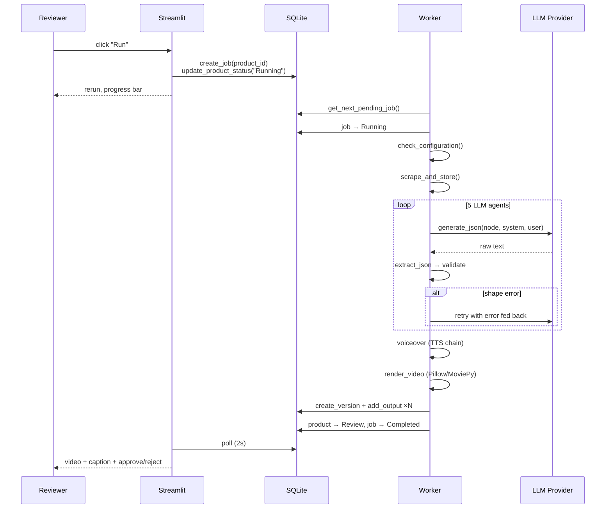
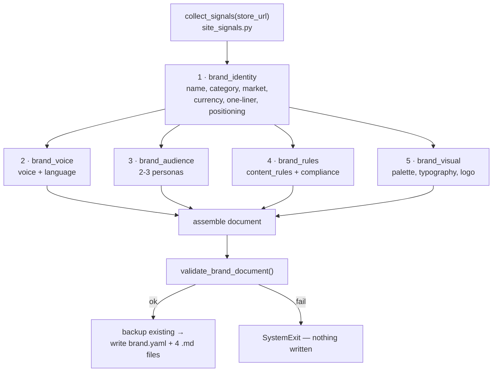
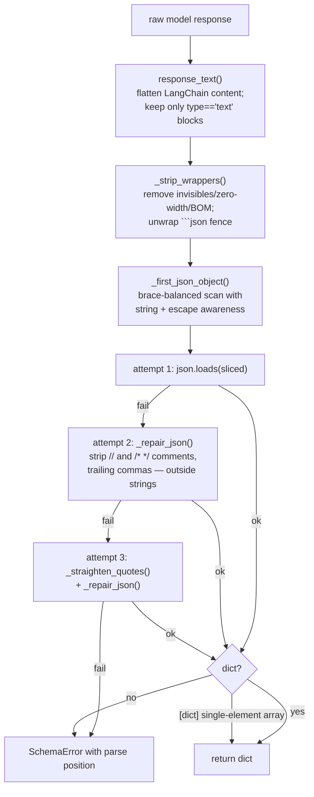
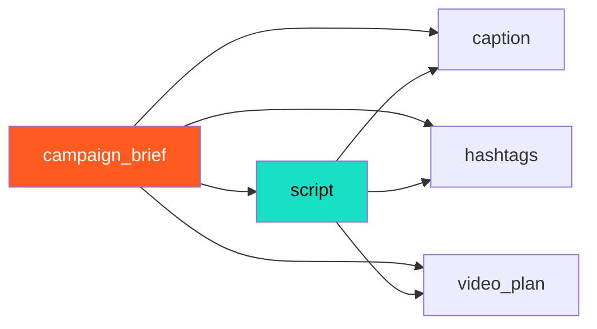
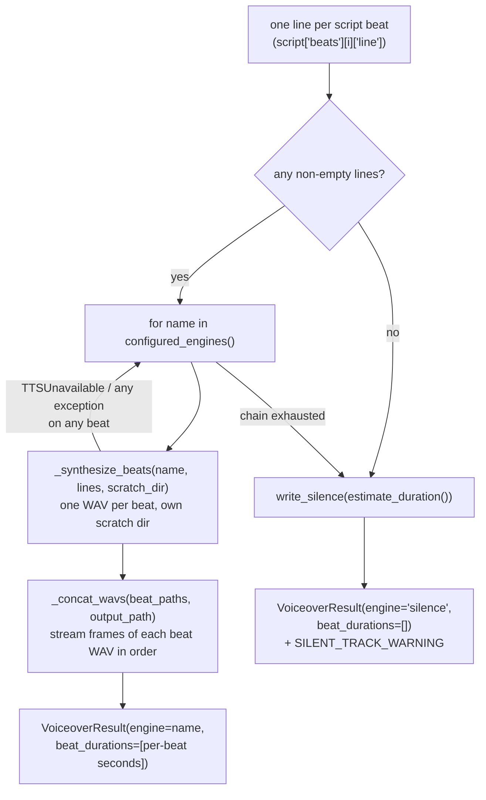
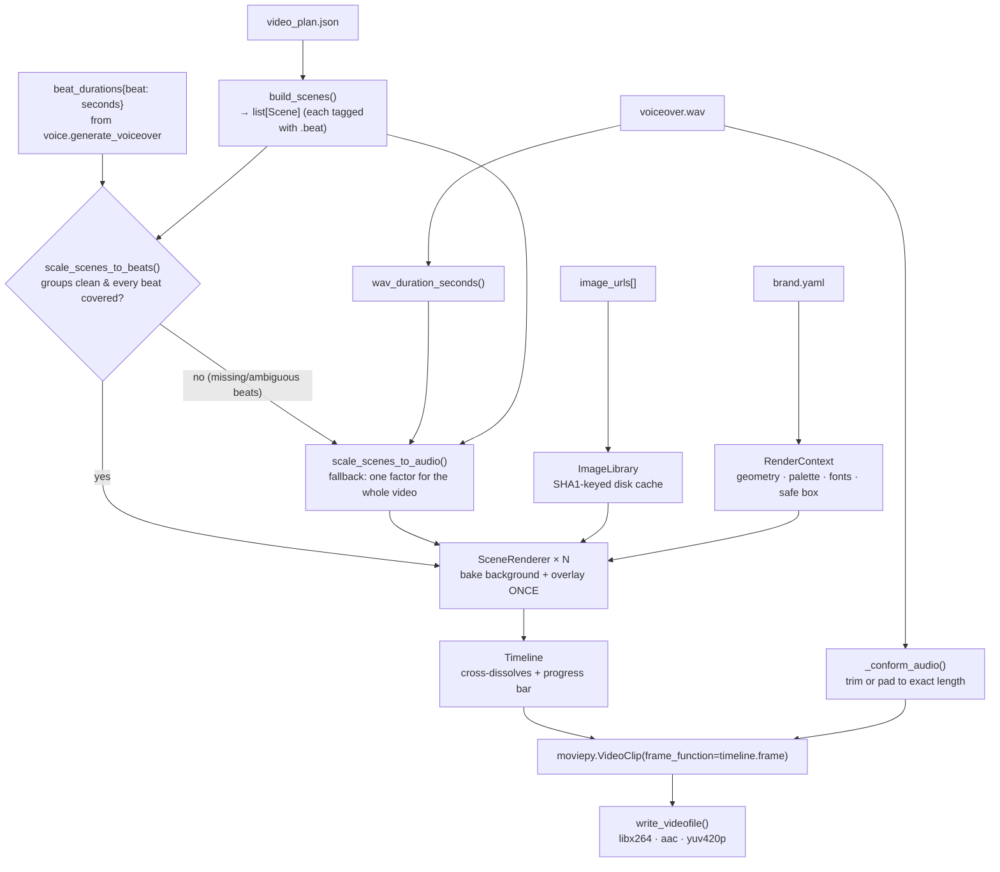
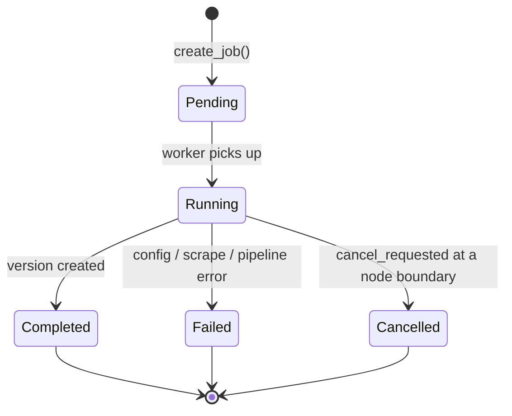
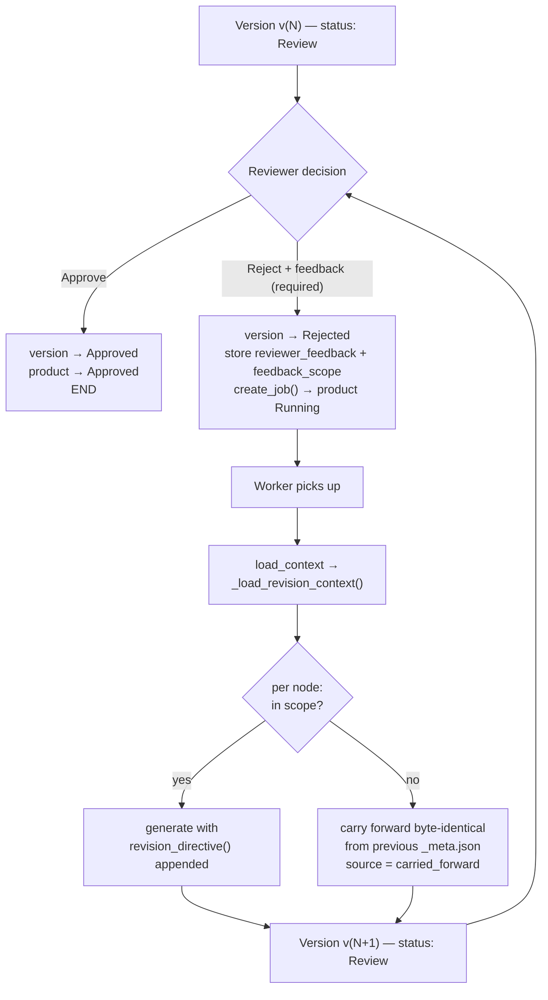

# AI-Powered Marketing Content Generation — Complete Technical Documentation

**Version:** 1.2 · **Generated:** 20 August 2026 · **Branch:** `version2` · **Codebase:** ~6,650 lines of Python across 9 packages

---

## How to use this document

This is a single, self-contained reference for the entire project. It is written to serve three purposes at once:

| Purpose | How to read it |
|---|---|
| **Study / viva preparation** | Read §1–§4 for the shape, then §9–§14 for the mechanisms. §21 is a viva Q&A bank. |
| **Feeding to an LLM** | Paste the whole file. Every architectural decision, data shape, constant and algorithm is stated explicitly, so a model can answer detailed questions or generate a report without seeing the code. |
| **Rebuilding the project** | §20 is a dependency-ordered build sequence. Every module's contract is specified precisely enough to reimplement it. |

Code excerpts are the load-bearing 10–40 lines of each component, not the full source. Everything not quoted is described in prose precise enough to reconstruct.

---

## Table of contents

1. [What the system does](#1-what-the-system-does)
2. [The governing design rule](#2-the-governing-design-rule)
3. [Technology stack](#3-technology-stack)
4. [System architecture](#4-system-architecture)
5. [Repository layout](#5-repository-layout)
6. [Configuration layer — `config/`](#6-configuration-layer--config)
7. [Data layer — `database/`](#7-data-layer--database)
8. [Brand system — `brand/`](#8-brand-system--brand)
9. [Scraper — `scraper/`](#9-scraper--scraper)
10. [The LLM gateway — `graph/llm.py`](#10-the-llm-gateway--graphllmpy)
11. [Prompt construction — `graph/prompts.py`](#11-prompt-construction--graphpromptspy)
12. [Validation & normalization — `graph/schemas.py`](#12-validation--normalization--graphschemaspy)
13. [The pipeline — `graph/state.py`, `graph/pipeline.py`, `graph/nodes.py`](#13-the-pipeline--state-topology-and-the-nine-nodes)
14. [Media generation — `media/`](#14-media-generation--media)
15. [The worker — `worker/`](#15-the-worker--worker)
16. [User interface — `streamlit_app/`](#16-user-interface--streamlit_app)
17. [End-to-end walkthrough with real data](#17-end-to-end-walkthrough-with-real-data)
18. [The human-in-the-loop review system](#18-the-human-in-the-loop-review-system)
19. [Failure taxonomy and consistency guarantees](#19-failure-taxonomy-and-consistency-guarantees)
20. [Testing strategy](#20-testing-strategy)
21. [Rebuilding the project from scratch](#21-rebuilding-the-project-from-scratch)
22. [Viva question bank](#22-viva-question-bank)
23. [Glossary](#23-glossary)
24. [Known limitations and future work](#24-known-limitations-and-future-work)

---

## 1. What the system does

Given **one public Shopify product URL**, the system produces a complete, reviewable social-media marketing package:

| Artifact | Format | Produced by |
|---|---|---|
| Campaign brief | `campaign_brief.md` + `.json` | LLM agent |
| Voiceover script (5 beats) | `script.md` + `.json` | LLM agent |
| Instagram/Reels caption | `caption.txt` | LLM agent |
| Hashtag set (8–12 tags) | `hashtags.txt` | LLM agent |
| Shot-by-shot video plan | `video_plan.json` | LLM agent |
| Narration track | `voiceover.wav` | TTS chain (ElevenLabs → Piper → pyttsx3) |
| Rendered vertical video | `video.mp4` (1080×1920, 30 fps, H.264+AAC) | Pillow + NumPy + MoviePy |
| Provenance sidecar | `_meta.json` | Pipeline `finalize` node |

It then routes that package through a **human approve/reject loop**. A rejection requires written feedback, which becomes the primary instruction for the next generation. The reviewer can *scope* the feedback to specific parts (caption, hashtags, video plan, script); anything outside the scope is carried forward byte-identical from the previous version rather than regenerated and re-billed.

### The one-sentence description

> A LangGraph multi-agent pipeline that converts scraped e-commerce product facts into brand-compliant short-form video marketing assets, with strict anti-hallucination guarantees and a feedback-driven regeneration loop.

---

## 2. The governing design rule

Everything in this codebase follows from a single rule:

> **A reviewer must never be shown something misleading.**

The specific failure this rules out is marketing copy that reads plausibly, is brand-shaped, quotes the right product name — and was written by nobody. That is *worse* than an error message, because it can be approved and published.

Five concrete consequences, each visible in the code:

| Consequence | Where it lives |
|---|---|
| **No placeholder content anywhere.** If a model can't produce valid output, the run fails. There is no canned fallback copy in the codebase. | `graph/llm.py` raises; `graph/nodes.py` lets it propagate |
| **Agents may only state scraped facts.** Every prompt carries a `# HARD RULE ON FACTS` block. | `graph/prompts.py::_agent_system()` |
| **Validation is strict about claims, lenient about formatting.** A missing `#` on a hashtag is fixed silently; a nonexistent persona id is rejected. | `graph/schemas.py` |
| **Degraded output is flagged in the UI, not buried in a log.** A silent voiceover produces a banner above the video on the review page. | `streamlit_app/_shared.py::render_warnings()` |
| **A failed run deletes its own half-written output directory.** | `graph/nodes.py::discard_orphan_version_dirs()` |

There is exactly **one** exception to "fail rather than degrade": a **video render failure** produces a version anyway, because the brief, script, caption and hashtags are all real, complete and reviewable without the MP4 — and recovering from an ffmpeg hiccup would otherwise mean regenerating (and re-paying for) every LLM call.

---

## 3. Technology stack

### Runtime dependencies (`requirements.txt`, exact pins)

| Layer | Package | Version | Role |
|---|---|---|---|
| UI | `streamlit` | 1.38.0 | Dashboard + review pages |
| Config | `python-dotenv` | 1.0.1 | `.env` loading |
| Scraping | `requests` | 2.32.3 | HTTP with pooling/retries |
| Scraping | `beautifulsoup4` | 4.12.3 | HTML spec-table parsing |
| Brand | `PyYAML` | 6.0.3 | `brand.yaml` parsing |
| Orchestration | `langgraph` | 1.2.10 | State-graph pipeline engine |
| LLM | `langchain-openai` | 1.4.1 | OpenAI adapter |
| LLM | `langchain-google-genai` | 4.3.2 | Gemini adapter |
| LLM | `langchain-anthropic` | 1.5.4 | Anthropic adapter |
| Media | `moviepy` | 2.2.1 | Video encoding + audio muxing |
| Media | `imageio-ffmpeg` | 0.6.0 | **Bundled ffmpeg binary** — no system install needed |
| Media | `pillow` | 10.4.0 | All frame compositing and text rendering |
| Media | `numpy` | 2.5.1 | Frame buffers, cutout flood fill |
| TTS | `elevenlabs` | 1.58.0 | Hosted neural voice — default, leads the TTS chain |
| TTS | `piper-tts` | 1.3.0 | Local/offline neural voice — fallback |
| Test | `pytest` | 8.3.3 | 174 tests, no network, no API key |

**Notably absent:** no ORM (raw `sqlite3`), no web framework (Streamlit only), no ImageMagick (Pillow does all text), no system ffmpeg, no vector DB, no external queue (SQLite *is* the queue).

**Storage:** SQLite in WAL mode at `data/app.db`. Python ≥3.10 (uses `X | Y` type unions and `str | None` syntax).

### Why these choices

- **LangGraph over a hand-rolled loop** — the fan-out (caption ∥ hashtags ∥ video_plan) is a real parallel superstep with typed state merging via reducers. Writing that by hand means writing thread coordination and merge logic.
- **SQLite over Postgres/Redis** — single-machine deployment, and the queue semantics needed (FIFO, one worker, terminal statuses) fit in six tables. WAL mode makes the concurrent worker-thread/UI-thread access safe.
- **Pillow over MoviePy's `TextClip`** — `TextClip` shells out to ImageMagick, which is a classic deployment failure. Pillow also buys letter-spacing, drop shadows, measured word-wrap and rounded pill backgrounds, none of which `TextClip` does well.
- **One `VideoClip` with a hand-written frame function over `concatenate_videoclips`** — owning the timeline is what makes eased camera movement, text pinned while the image moves behind it, and dissolves on a known curve exact, deterministic and testable.

---

## 4. System architecture

### The three-process shape



**The UI never runs inference.** It queues a job and reads results. The worker owns the pipeline. Three things follow from that split:

1. The UI stays responsive during a two-minute video render.
2. `python -m worker.run` can be moved to another machine without touching the UI.
3. A reviewer's reject is instantaneous — it writes a row and returns; the regeneration happens asynchronously.

For local use, `worker/autostart.py` runs the same worker loop on a **daemon thread inside the Streamlit process**, so one command runs everything and a job can never sit `Pending` because nothing was alive to process it.

### The pipeline graph



Nine nodes, fixed depth 7 supersteps. The `caption`/`hashtags`/`video_plan` layer is a **genuine parallel superstep** in LangGraph terms: all three are dispatched together and `voiceover` waits for all of them. This is safe because those three nodes write **disjoint** state keys, and the keys they *share* (`artifacts`, `warnings`, `sources`) carry explicit reducers.

### Request lifecycle (sequence)



---

## 5. Repository layout

```
AI-Powered-Marketing-Content-Generation/
├── brand/                       # Brand system — the source of truth for voice & visuals
│   ├── brand.yaml               #   173 lines — machine-readable brand definition
│   ├── loader.py                #   239 — parse, validate, expose typed views
│   ├── generate.py              #   513 — regenerate brand/ from any Shopify store
│   ├── site_signals.py          #   129 — scrape brand signals from a storefront
│   ├── BRAND_GUIDELINES.md      #   prose companions — the "why"
│   ├── PERSONAS.md
│   ├── VISUAL_IDENTITY.md
│   └── COMPLIANCE.md
├── config/
│   ├── settings.py              #   161 — typed, validated .env reader
│   ├── http.py                  #    49 — shared retrying requests.Session
│   └── logging_setup.py         #    62 — console + rotating file handlers
├── database/
│   ├── schema.sql               #    83 — 6 tables, CHECK constraints, indexes
│   ├── connection.py            #    70 — WAL connections, context manager, migrations
│   ├── models.py                #   114 — typed dataclasses mirroring the schema
│   ├── repository.py            #   425 — every CRUD operation
│   ├── seed_products.py         #    67 — idempotent starter catalog
│   └── reset.py                 #    81 — destructive full wipe + re-seed
├── graph/                       # The LangGraph pipeline
│   ├── pipeline.py              #   180 — topology, run_pipeline(), cancellation
│   ├── nodes.py                 #   518 — the 9 node functions + feedback scoping
│   ├── prompts.py               #   280 — per-agent prompt builders
│   ├── schemas.py               #   381 — validators/normalizers per agent
│   ├── llm.py                   #   504 — provider registry, JSON extraction, repair-retry
│   └── state.py                 #    74 — PipelineState TypedDict + reducers
├── media/
│   ├── movie.py                 #  1131 — the renderer
│   └── voice.py                 #   370 — TTS engine chain (ElevenLabs → Piper → pyttsx3), per-beat synthesis
├── scraper/
│   ├── shopify.py               #   139 — parse a Shopify product .json endpoint
│   └── run.py                   #    96 — scrape_and_store() + CLI
├── worker/
│   ├── run.py                   #   156 — the polling loop and job lifecycle
│   └── autostart.py             #    33 — run the worker in a Streamlit thread
├── streamlit_app/
│   ├── app.py                   #   263 — Dashboard
│   ├── pages/1_Output.py        #   384 — Review page
│   └── _shared.py               #   193 — stage labels, CSS injection, warnings
├── tests/                       #   174 collected tests, no network, no API key
├── docs/architecture/
│   ├── CONTEXT.md               #   architecture + rationale
│   └── llm-providers.md         #   provider switching guide
├── data/
│   ├── app.db                   #   SQLite database
│   ├── assets/                  #   URL-hashed product image cache
│   └── voices/                  #   Piper .onnx voice model + sidecar
├── output/<product-slug>/v<N>/  #   one immutable directory per version
├── logs/app.log                 #   rotating log file
├── .env / .env.example
├── requirements.txt
├── pyproject.toml               #   pytest config only
└── run_app.bat                  #   Windows one-click launcher
```

### Entry points

| Command | Effect |
|---|---|
| `streamlit run streamlit_app/app.py` | Dashboard **and** the worker (autostart thread) |
| `python -m worker.run` | Worker only, as a long-lived process (production shape) |
| `python -m database.seed_products` | Insert the 3 starter products (idempotent) |
| `python -m database.reset [--yes] [--keep-cache] [--no-seed]` | Destructive wipe + re-seed |
| `python -m scraper.run --product-id N` / `--all` | Re-scrape without generating |
| `python -m graph.pipeline N` | Run the full pipeline for one product, no worker |
| `python -m media.movie --plan path/to/video_plan.json` | Re-render just the video, zero model calls |
| `python -m media.voice --text "..."` | Test the TTS chain |
| `python -m brand.generate <store-url> [--out DIR]` | Regenerate the whole brand folder |
| `pytest` | 174 tests |

---

## 6. Configuration layer — `config/`

### 6.1 `settings.py` — typed, fail-fast environment reading

Every value is read through a typed helper that fails **at import** with the variable's name in the message. A typo like `VIDEO_FPS=thirty` stops the process immediately rather than surfacing eight minutes into a render as a `ValueError` from inside ffmpeg.

```python
def _raw(name: str, default: str = "") -> str:
    value = os.getenv(name)
    # Strip inline `# comment` tails: .env files are edited by hand and the
    # example file documents options that way, so `VIDEO_FPS=30  # or 60` is a
    # realistic thing to find here.
    if value is not None and "#" in value:
        value = value.split("#", 1)[0]
    return (value if value is not None else default).strip()

def _int(name: str, default: int, *, minimum: int | None = None) -> int:
    raw = _raw(name)
    if not raw:
        return default
    try:
        value = int(raw)
    except ValueError:
        raise ConfigError(f"{name} must be a whole number, got {raw!r}") from None
    if minimum is not None and value < minimum:
        raise ConfigError(f"{name} must be at least {minimum}, got {value}")
    return value
```

Helpers: `_raw`, `_path`, `_int`, `_float`, `_choice`, `_csv`.

**Two design decisions worth quoting in a viva:**

1. **Paths resolve against `BASE_DIR`, not the process cwd.**
   ```python
   def _path(name: str, default: str) -> Path:
       raw = Path(_raw(name, default) or default)
       return raw if raw.is_absolute() else (BASE_DIR / raw).resolve()
   ```
   Streamlit and the CLI entry points get launched from different working directories; anchoring to `BASE_DIR` keeps every entry point pointing at the same database and output files.

2. **API keys default to empty, not to a placeholder string.** An unset key must *look* unset, so the error says `GEMINI_API_KEY is not set` rather than surfacing a provider's generic 401 several layers down.

### Complete settings reference

| Setting | Default | Constraint | Consumer |
|---|---|---|---|
| `DATABASE_PATH` | `./data/app.db` | path | `database/connection.py` |
| `OUTPUT_DIR` | `./output` | path | `database/repository.py` |
| `LOG_DIR` | `./logs` | path | `config/logging_setup.py` |
| `BRAND_DIR` | `./brand` | path | `brand/loader.py` |
| `ASSET_CACHE_DIR` | `./data/assets` | path | `media/movie.py::ImageLibrary` |
| `LOG_LEVEL` | `INFO` | debug\|info\|warning\|error | logging |
| `LOG_MAX_BYTES` | 5,000,000 | ≥10,000 | rotating handler |
| `LOG_BACKUP_COUNT` | 5 | ≥0 | rotating handler |
| `WORKER_POLL_INTERVAL_SECONDS` | 5 | ≥1 | `worker/run.py` |
| `LLM_PROVIDER` | `gemini` | openai\|gemini\|anthropic | `graph/llm.py` |
| `OPENAI_API_KEY` / `OPENAI_MODEL` / `OPENAI_BASE_URL` | — / `gpt-5.1` / None | | provider block |
| `GEMINI_API_KEY` / `GEMINI_MODEL` / `GEMINI_BASE_URL` | — / `gemini-2.5-pro` / None | | provider block |
| `ANTHROPIC_API_KEY` / `ANTHROPIC_MODEL` / `ANTHROPIC_BASE_URL` | — / `claude-opus-5` / None | | provider block |
| `LLM_MAX_TOKENS` | 8000 | ≥256 | all providers |
| `LLM_TIMEOUT_SECONDS` | 120 | ≥5 | all providers |
| `LLM_MAX_RETRIES` | 3 | ≥0 | **transport** retries, done by the provider client |
| `LLM_JSON_ATTEMPTS` | 3 | ≥1 | **shape** retries, done by `generate_json()` |
| `VIDEO_ASPECT` | `vertical` | vertical\|square\|landscape | renderer |
| `VIDEO_FPS` | 30 | ≥1 | renderer |
| `VIDEO_RENDER_THREADS` | 4 | ≥1 | ffmpeg |
| `VOICEOVER_SAMPLE_RATE` | 44100 | ≥8000 | silent-track writer |
| `TTS_ENGINES` | `elevenlabs,piper,pyttsx3` | CSV, ordered | `media/voice.py` |
| `ELEVENLABS_API_KEY` | None | | elevenlabs engine |
| `ELEVENLABS_VOICE_ID` | `21m00Tcm4TlvDq8ikWAM` ("Rachel") | | elevenlabs engine |
| `PIPER_MODEL_PATH` | None | path to `.onnx` | piper engine |
| `HTTP_TIMEOUT_SECONDS` | 20 | ≥1 | shared session |
| `HTTP_MAX_RETRIES` | 3 | ≥0 | shared session |

`ensure_directories()` runs at import and creates `data/`, `output/`, `logs/`, `data/assets/`.

### 6.2 `http.py` — one shared, retrying session

Three modules fetch over HTTP: the product scraper, the brand-signal collector, and the renderer's image library. Each previously called `requests.get` directly — meaning no connection reuse (a 12-image render opened 12 TLS connections to the same host) and no retry (a single dropped packet failed a whole job).

```python
@functools.lru_cache(maxsize=1)
def http_session() -> requests.Session:
    session = requests.Session()
    session.headers.update({"User-Agent": USER_AGENT})
    retry = Retry(
        total=HTTP_MAX_RETRIES, connect=HTTP_MAX_RETRIES,
        read=HTTP_MAX_RETRIES, status=HTTP_MAX_RETRIES,
        backoff_factor=0.5,
        status_forcelist=(429, 500, 502, 503, 504),
        allowed_methods=frozenset({"GET", "HEAD"}),
        raise_on_status=False,
        respect_retry_after_header=True,
    )
    adapter = HTTPAdapter(max_retries=retry, pool_connections=8, pool_maxsize=16)
    session.mount("https://", adapter); session.mount("http://", adapter)
    return session
```

**Client errors like 404 are deliberately not retried** — a product page that doesn't exist won't start existing.

### 6.3 `logging_setup.py` — idempotent dual-handler logging

Console output stays human-readable; a `RotatingFileHandler` writes `logs/app.log` (5 MB × 5 backups) so a long-running worker cannot fill a disk. This matters specifically because **the Streamlit-hosted worker swallows stderr entirely** — without the file handler, the one thing you need when a run misbehaves (what the model returned, which TTS engine was used, why a render warned) is unavailable after the fact.

`configure_logging()` is **idempotent** via a module-level `_configured` flag: Streamlit re-runs its script on every interaction, and re-adding handlers each time would multiply every log line. Noisy third-party loggers (`httpx`, `httpcore`, `urllib3`, `PIL`, `matplotlib`, `google_genai`) are pinned to `WARNING`.

---

## 7. Data layer — `database/`

### 7.1 Schema (`schema.sql`) — six tables

```mermaid
erDiagram
    products ||--o{ jobs : "queues"
    products ||--o| scraped_data : "has one"
    products ||--o{ versions : "produces"
    products ||--o{ logs : "records"
    jobs ||--o{ versions : "created by"
    jobs ||--o{ logs : "records"
    versions ||--o{ outputs : "contains"

    products {
        int id PK
        text name
        text url UK
        text status "CHECK 7 values"
        text output_dir
        text created_at
        text updated_at
    }
    jobs {
        int id PK
        int product_id FK
        text status "CHECK 5 values"
        text error_message
        text current_stage
        int cancel_requested
        text created_at
        text started_at
        text completed_at
    }
    versions {
        int id PK
        int product_id FK
        int job_id FK
        int version_number
        text status "Review|Approved|Rejected"
        text reviewer_feedback
        text feedback_scope
        text output_dir
        text created_at
    }
    outputs {
        int id PK
        int version_id FK
        text output_type "CHECK 7 values"
        text file_path
        text created_at
    }
    scraped_data {
        int id PK
        int product_id FK-UK
        text title
        text description_html
        text description_text
        real price
        real compare_at_price
        text image_urls "JSON array"
        text specs "JSON object"
        text scraped_at
    }
    logs {
        int id PK
        int product_id FK
        int job_id FK
        text level "CHECK 4 values"
        text message
        text created_at
    }
```

**Status enumerations, enforced by SQL `CHECK` constraints and mirrored in `models.py`:**

| Entity | Statuses |
|---|---|
| Product | `Pending → Running → Review → Approved \| Rejected \| Failed \| Cancelled` |
| Job | `Pending → Running → Completed \| Failed \| Cancelled` |
| Version | `Review → Approved \| Rejected` |
| Output type | `campaign_brief`, `script`, `caption`, `hashtags`, `voiceover`, `video_plan`, `video` |
| Log level | `DEBUG`, `INFO`, `WARNING`, `ERROR` |

**Key constraints:**
- `products.url` is `UNIQUE` — this is what makes seeding idempotent.
- `versions (product_id, version_number)` is `UNIQUE` — versions are immutable and never overwritten.
- `scraped_data.product_id` is `UNIQUE` — one scrape row per product, upserted.
- Every FK cascades on delete, except `versions.job_id` which is `ON DELETE SET NULL`.
- Five indexes: `jobs(product_id)`, `jobs(status)`, `versions(product_id)`, `outputs(version_id)`, `logs(product_id)`.

### 7.2 `connection.py` — WAL mode and in-place migrations

```python
def get_connection() -> sqlite3.Connection:
    conn = sqlite3.connect(DATABASE_PATH, timeout=30)
    conn.row_factory = sqlite3.Row
    conn.execute("PRAGMA foreign_keys = ON")
    conn.execute("PRAGMA journal_mode = WAL")
    conn.execute("PRAGMA busy_timeout = 30000")
    return conn

@contextmanager
def connection_scope() -> Iterator[sqlite3.Connection]:
    conn = get_connection()
    try:
        yield conn
        conn.commit()
    except Exception:
        conn.rollback()
        raise
    finally:
        conn.close()
```

**Why WAL + busy timeout:** the worker thread and the Streamlit polling thread share one database file. In rollback-journal mode a writer blocks readers; WAL lets them proceed concurrently, and the 30-second busy timeout absorbs the remaining contention so neither side ever raises `database is locked`.

**Migrations without a table rebuild.** `CREATE TABLE IF NOT EXISTS` never touches an existing table, so columns added after the initial schema go through `_migrate()`, guarded by a `PRAGMA table_info` existence check so re-running is always a no-op:

```python
def _migrate(conn):
    existing = {row["name"] for row in conn.execute("PRAGMA table_info(jobs)")}
    if "current_stage" not in existing:
        conn.execute("ALTER TABLE jobs ADD COLUMN current_stage TEXT")
    if "cancel_requested" not in existing:
        conn.execute("ALTER TABLE jobs ADD COLUMN cancel_requested INTEGER NOT NULL DEFAULT 0")
    existing_version_cols = {row["name"] for row in conn.execute("PRAGMA table_info(versions)")}
    if "feedback_scope" not in existing_version_cols:
        conn.execute("ALTER TABLE versions ADD COLUMN feedback_scope TEXT")
```

### 7.3 `models.py` — typed dataclasses

Six `@dataclass`es mirror the six tables, each with a `from_row(sqlite3.Row)` classmethod. Two do real work beyond `cls(**dict(row))`:

- `Job.from_row` coerces `cancel_requested` from SQLite's integer to a Python `bool`.
- `ScrapedData.from_row` `json.loads()` the `image_urls` and `specs` columns, so callers get a real `list[str]` and `dict[str, str]`.

### 7.4 `repository.py` — every database operation

All 30-odd functions use `connection_scope()`. Grouped by entity:

**Products** — `create_product`, `get_product`, `list_products`, `count_rejections_by_product`, `update_product_status`, `update_product_name`, `delete_product`, `delete_product_with_files`, `slugify`, `_unique_output_dir`

Two subtleties:

```python
def slugify(name: str) -> str:
    """Falls back to "product" rather than returning an empty string: a name of
    only non-ASCII characters would otherwise collapse to `""` and every such
    product would share one output directory."""
    slug = _SLUG_SEPARATORS.sub("-", name.strip().lower()).strip("-")
    return slug or "product"

def _unique_output_dir(slug: str, conn) -> str:
    """`output/<slug>`, suffixed if another product already claimed it.
    Two products can legitimately share a name; they must never share an output
    directory, or approving one version would show the other's video."""
    base = OUTPUT_DIR / slug
    taken = {row["output_dir"] for row in conn.execute("SELECT output_dir FROM products")}
    candidate = str(base); suffix = 2
    while candidate in taken:
        candidate = str(base.with_name(f"{slug}-{suffix}")); suffix += 1
    return candidate
```

`delete_product_with_files()` removes the **DB row first**, the directory second, best-effort (`ignore_errors=True`) — so a product that no longer exists can never be left pointing at files, and a locked file doesn't make the row un-deletable.

**Jobs** — `create_job`, `get_next_pending_job` (FIFO: `ORDER BY created_at ASC LIMIT 1`), `update_job_status`, `get_job`, `get_active_job_for_product`, `update_job_stage`, `request_job_cancel`, `is_cancel_requested`, `list_jobs_for_product`, `reclaim_stale_jobs`, `count_active_jobs`

`reclaim_stale_jobs()` is the single most important consistency function in the file:

```python
def reclaim_stale_jobs() -> list[int]:
    """Fail any job still 'Running' at worker startup.

    A job can only be 'Running' while a worker process holds it in memory. If
    the worker is starting up and finds one anyway, the previous process died
    mid-job (crash, kill, host restart) without reaching the normal
    Completed/Failed transition, leaving `count_active_jobs()` permanently
    non-zero and the UI's Run button disabled forever."""
```

**Versions** — `create_version`, `next_version_number`, `list_versions_for_product` (newest first — callers rely on `[0]` being current), `update_version_status`

`next_version_number()` computes `MAX(version_number)+1` **without creating a row**. This lets the pipeline lay out `<product>/v<N>/` and write artifacts into it before committing a `versions` row, so a run that crashes half way through leaves files on disk but no empty version staring at a reviewer.

**Outputs** — `add_output`, `list_outputs_for_version`
**Scraped data** — `upsert_scraped_data` (`ON CONFLICT(product_id) DO UPDATE SET …`), `get_scraped_data`
**Logs** — `add_log`, `list_logs_for_product`

### 7.5 `seed_products.py` and `reset.py`

Seeding is idempotent by relying on the `url` UNIQUE constraint and catching `sqlite3.IntegrityError`. The three seed products are deliberately from *different collections* so the pipeline is exercised against genuinely different spec tables, price points and photo counts rather than three near-identical hoverboards.

`reset.py` deletes the database **plus its `-wal` and `-shm` sidecars** — leaving those behind next to a deleted database is exactly what produces `file is not a database` on next open.

---

## 8. Brand system — `brand/`

This is the layer that makes the system re-targetable. **There is no hard-coded hex value or content rule anywhere in the Python code.**

### 8.1 `brand.yaml` — the machine-readable source of truth

Two consumers read it:
1. `graph/prompts.py` — injects `brand`, `voice`, `audience`, `language`, `content_rules`, `compliance` into **every** agent prompt.
2. `media/movie.py` — reads `visual` for colours, fonts, safe areas and camera geometry.

The four `.md` companions (`BRAND_GUIDELINES`, `PERSONAS`, `VISUAL_IDENTITY`, `COMPLIANCE`) explain the *why*; the YAML is what the code parses.

#### Section-by-section

**`brand`** — identity: `name: Radboards`, `category`, `market: India`, `currency_symbol: "₹"`, `website`, `one_liner: "Built for the ride to everywhere."`, `positioning` (3 sentences).

**`voice`** — `archetype: "The Explorer, with an engineer's honesty"`, `personality` (5 traits), `tone_by_context` (per content type), 5 `principles`, `we_say` and `we_never_say` lists. The banned list is doing real work — it bans generic hype (*revolutionary, game-changing, disruptive, cutting-edge, seamless, synergy*), fake urgency, all medical/safety-guarantee claims, and competitor comparisons.

**`audience`** — `primary: urban-commuter` plus three personas, each with `id`, `name`, `snapshot`, `wants` (3), `fears` (3), `hook_that_works`:

| id | Persona | Wants | Fears |
|---|---|---|---|
| `urban-commuter` | Aditya, 26 — Bengaluru, hybrid, metro drops him 2.5 km from work | predictable commute time; carryable to a 3rd-floor flat; range he can trust | stranded at 40% battery; looking silly at work; cheap build |
| `campus-rider` | Nikita, 20 — engineering student, big campus | fun; fast between-class hops; looks good in a reel | parental veto on price; charging in a hostel; breaking it week one |
| `weekend-explorer` | Rohit, 34 — owns a car, gated township, Sunday rides | off-road capability; real torque; inspectable build quality | underpowered motor; tyres dying on gravel; water damage |

**`language`** — `reading_level: Grade 7`, `english: Indian English`, `sentence_max_words: 18`, per-context emoji policy, and a `numbers` rule ("render specs exactly as scraped — do not round, convert or invent units").

**`content_rules`** — this section directly drives `graph/schemas.py`:

| Rule path | Value | Enforced by |
|---|---|---|
| `campaign_brief.proof_points_min` | 3 | `schemas.campaign_brief` |
| `script.duration_seconds` | `[32, 40]` | `schemas.script` (± tolerance) |
| `script.words_per_second` | 2.4 | duration recomputation |
| `script.structure` | `[hook, problem, product_reveal, proof, cta]` | exact beat names, in order |
| `script.hook_max_words` | 12 | hook beat length |
| `caption.max_chars` | 300 | `schemas.caption` |
| `caption.first_line_max_chars` | 70 | derived first line |
| `caption.cta_required` | true | `cta` field required |
| `hashtags.count` | `[8, 12]` | min raise / max truncate |
| `hashtags.always_include` | `["#radboards"]` | inserted if missing |
| `hashtags.banned` | `#viral #followforfollow #likeforlike #trending #explorepage` | dropped silently |
| `video_plan.scene_count` | `[5, 7]` | `schemas.video_plan` |

**`compliance`** — `must` (3 rules), `must_not` (4 rules), `disclosure` (one sentence about manufacturer-claim variance). These reach the model as prompt text; they are not mechanically validated, which is an acknowledged limitation (see §24).

**`visual`** — consumed only by the renderer:

| Token | Hex | Role |
|---|---|---|
| `ink` | `#0B0E14` | base background, letterbox fill |
| `surface` | `#151C28` | cards, lower-third plates, progress-bar track |
| `primary` | `#FF5A1F` | "ignite orange" — CTA, key numbers, progress fill |
| `accent` | `#17E0C4` | "charge teal" — secondary highlights, spec labels, rule |
| `paper` | `#F5F7FA` | primary text on dark |
| `muted` | `#9AA7B8` | secondary text |

Plus `gradient_scrim: ["#0B0E14", "#0B0E1400"]`, typography (display: Bahnschrift with a 4-file candidate chain, uppercase, 2 px tracking; body: Segoe UI), and video geometry:

```yaml
video:
  aspect: vertical
  width: 1080
  height: 1920
  fps: 30
  safe_area: {top: 220, bottom: 380, left: 72, right: 72}   # clear of Reels/Shorts UI
  ken_burns: {zoom_start: 1.06, zoom_end: 1.18, max_pan_px: 90}
  transition_seconds: 0.45
  title_card_seconds: 2.2
  cta_card_seconds: 3.0
logo: {wordmark: RADBOARDS, lockup_position: top-left, clear_space_px: 48}
```

### 8.2 `loader.py` — validation, caching, derived views

**`REQUIRED_PATHS`** is a 40-entry tuple of dotted key paths — *every* path the rest of the codebase reads out of `brand.yaml`, with `[]` marking "must be a non-empty list".

> Why this exists: a brand file missing `content_rules.script.words_per_second` parses fine, loads fine, and then dies with a bare `KeyError` inside the voiceover node twenty seconds into a **paid** pipeline run. Checking once at load turns that into one clear message.

`validate_brand_document()` reports **all** problems at once (fixing a generated brand file one missing key per run would be miserable), and additionally checks:
- every persona has `id`, `name`, `wants`, `fears`;
- the three `[low, high]` pairs are 2-element and ordered.

**`Brand`** is a deliberately thin accessor. The YAML *is* the schema; wrapping every nested key in a dataclass would mean editing Python every time the brand gains a rule. What the class adds is the **derived views**:

```python
def prompt_block(self) -> str:
    """The brand rules, rendered for injection into every agent prompt.
    Only the sections an agent can act on are included — the `visual` block is
    the renderer's business and would be pure token cost in a copy prompt."""
    sections = {
        "BRAND": self._data["brand"], "VOICE": self._data["voice"],
        "AUDIENCE": self._data["audience"], "LANGUAGE": self._data["language"],
        "CONTENT RULES": self._data["content_rules"], "COMPLIANCE": self._data["compliance"],
    }
    parts = []
    for heading, body in sections.items():
        rendered = yaml.safe_dump(body, sort_keys=False, allow_unicode=True).strip()
        parts.append(f"## {heading}\n{rendered}")
    return "\n\n".join(parts)
```

Plus `color(token) -> (r,g,b)`, `font_candidates(role)`, `tracking(role)`, `persona(id)`, and the module-level `hex_to_rgb` / `hex_to_rgba` (the latter handles `#RRGGBBAA` for the gradient scrim).

`load_brand()` is `@functools.lru_cache(maxsize=1)` — parsed once per process, since the file does not change at runtime. `reload_brand()` clears it, for tests and `brand.generate`.

### 8.3 `generate.py` — retargeting the whole system at any Shopify store

```
python -m brand.generate https://your-store.myshopify.com
```

Five focused prompts run against one scraped-catalog signal set, each responsible for one section:



Three design points:

1. **All-or-nothing.** If any section can't be generated, the command fails and writes nothing. A brand document is the input to every agent prompt and every rendered frame, so a partially-invented one would silently mis-brand everything produced from it — far worse than having no brand file at all.
2. **Video geometry is not generated.** Safe areas and Ken Burns amounts are a *platform* fact (Reels/Shorts/TikTok), not a brand fact, so every generated brand gets the same technically-correct `DEFAULT_VIDEO` constants.
3. **The four prose docs are formatted from the same structured data**, not generated by a sixth LLM call — so they cannot drift from `brand.yaml`.

Backup is **scoped to exactly five filenames** (`brand.yaml` + the four `.md`), because `brand/` also holds this script's own code, which must never be moved. Backups land in `brand_backups/<name>_<timestamp>/`. Generation happens *before* any backup is taken, so the live folder is never touched unless there is a complete valid document to replace it with.

The section validator is deliberately loose (`_require_keys` — every key present and non-empty), because unlike the content pipeline a brand document is written to disk for a human to read and edit before it is ever used, and the assembled result is checked properly by `validate_brand_document()`.

### 8.4 `site_signals.py` — shallow brand reconnaissance

`collect_signals(store_url)` returns:

| Key | Source |
|---|---|
| `root_url` | scheme+netloc of the input |
| `site_title`, `meta_description`, `theme_color` | homepage `<title>` and `<meta>` tags |
| `currency_code` | regex over `Shopify.currency = {... "active":"XXX" ...}` in the homepage HTML |
| `about_snippet` | first ≤500 chars of an "about"/"our story" page, if the nav links to one |
| `sample_products` | up to 20 from `/products.json?limit=20` — title, product_type, tags, price min/max, ≤500-char description |

Raises `SiteSignalError` if `/products.json` yields nothing — that catalog is the one thing every downstream prompt depends on.

---

## 9. Scraper — `scraper/`

### 9.1 `shopify.py` — the data source

**The core insight:** any Shopify storefront exposes structured product data at `<product-url>.json` — title, `body_html`, variants with prices, and images — with **no auth and no JS rendering required**. Nothing in this module is Radboards-specific, which is what lets `brand/generate.py` repoint the whole system at a different store.

```python
def json_url(product_url: str) -> str:
    scheme, netloc, path, _query, _fragment = urlsplit(product_url)
    if not scheme or not netloc:
        raise ScrapeError(f"{product_url!r} is not a valid absolute URL")
    path = path.rstrip("/")
    if not path.endswith(".json"):
        path += ".json"
    return urlunsplit((scheme, netloc, path, "", ""))
```

Note it drops query and fragment, strips a trailing slash, and is idempotent.

**Spec-table extraction.** The description's spec table (charging time, motor, range…) arrives as a plain HTML `<table>` inside `body_html`. It is parsed out *separately* from the descriptive prose so agents can quote specs verbatim — and the table is `decompose()`d so its cells don't also appear in the prose text:

```python
def _parse_specs_and_description(body_html: str) -> tuple[dict[str, str], str]:
    soup = BeautifulSoup(body_html or "", "html.parser")
    specs: dict[str, str] = {}
    for table in soup.find_all("table"):
        for row in table.find_all("tr"):
            cells = row.find_all(["td", "th"])
            if len(cells) >= 2:
                key = " ".join(cells[0].get_text(strip=True).split())
                value = " ".join(cells[1].get_text(strip=True).split())
                if key and value and len(specs) < MAX_SPECS:      # MAX_SPECS = 40
                    specs[key] = value[:MAX_SPEC_VALUE_CHARS]     # 200 chars
        table.decompose()
    description_text = " ".join(soup.get_text(separator=" ").split())
    return specs, description_text
```

**Variant selection** — this is a correctness decision, not a convenience:

```python
def _cheapest_available_variant(variants: list[dict]) -> dict:
    """Taking `variants[0]` blindly is wrong on any store whose first variant is
    sold out or is an accessory add-on: the brief would then be built around a
    price the customer can't buy at. Prefer available variants, cheapest first."""
    if not variants: return {}
    priced = [v for v in variants if _to_float(v.get("price")) is not None]
    if not priced: return variants[0]
    available = [v for v in priced if v.get("available", True)]
    return min(available or priced, key=lambda v: _to_float(v.get("price")) or 0.0)
```

**Degradation policy:** a bad price string becomes `None` with a warning rather than failing the scrape; a product with no images logs a warning and lets the renderer fall back to brand gradients. Only a fetch failure, a non-200, non-JSON, or a missing `product` object raise `ScrapeError`.

Returns a dict of exactly: `title`, `description_html`, `description_text`, `price`, `compare_at_price`, `image_urls`, `specs`.

### 9.2 `run.py` — `scrape_and_store()`

Called by the worker as the first stage of every job. It:
1. loads the product row (raises `ValueError` if absent);
2. scrapes (logs to the `logs` table and re-raises on `ScrapeError`);
3. **updates the product name if the store's title changed** — the scraped title is authoritative, so the name typed into the Add Product form is only a placeholder until the first run;
4. upserts `scraped_data`;
5. writes an `INFO` log: `"Scraped OK: N images, M specs"`.

The CLI (`--product-id N` or `--all`) exits non-zero if any product failed.

---

## 10. The LLM gateway — `graph/llm.py`

This is the single place the system talks to a model, **and the single place it gives up.** Three guarantees, in priority order:

1. **Nothing is ever invented locally.** If the model can't be reached, or can't produce output matching the requested shape, this raises.
2. **The response is parsed defensively.** Models wrap JSON in prose, in fences, with trailing commas, smart quotes, `//` comments.
3. **A malformed response is retried with the error fed back.**

### 10.1 Exception hierarchy

```
LLMError (RuntimeError)              ← callers abort the run on any of these
├── LLMConfigurationError            ← unknown provider name, or missing API key
├── LLMUnavailableError              ← provider unreachable or rejected the request
└── MalformedResponseError           ← model replied, never with the right shape

SchemaError (ValueError)             ← a parsed payload violated its node's schema
```

`SchemaError` messages are written to be handed **straight back to the model as a correction**, so they are phrased as instructions (`"beats" must contain exactly 5 entries`), not as diagnostics (`len(beats) == 3`).

### 10.2 Provider registry

Provider selection is config-only. `LLM_PROVIDER` picks a builder out of `_PROVIDER_BUILDERS`:

```python
_PROVIDER_BUILDERS: dict[str, Callable[[ProviderConfig], Any]] = {
    "openai":    _build_openai,      # langchain_openai.ChatOpenAI
    "gemini":    _build_gemini,      # langchain_google_genai.ChatGoogleGenerativeAI
    "anthropic": _build_anthropic,   # langchain_anthropic.ChatAnthropic
}
```

Each builder passes `LLM_MAX_TOKENS`, `LLM_TIMEOUT_SECONDS` and `LLM_MAX_RETRIES` through to the client. Adding a provider means: a settings block, a `ProviderConfig` entry, one builder, one `requirements.txt` line, one entry in the `_choice()` tuple. **Nothing else in the system knows which provider is in use.**

`_provider_configs()` is deliberately **not cached** — tests and `python -m` entry points that call `load_dotenv()` late reload settings, and a cache would pin the first-seen values. `get_chat_model()` *is* cached (`lru_cache(maxsize=1)`) since building a client is expensive; `reset_model_cache()` clears it.

**Placeholder detection** — a key matching any of `dummy`, `placeholder`, `changeme`, `your-key`, `your_key`, `xxx`, `todo` (case-insensitive substring) is treated as absent, so the failure names the real problem instead of surfacing a provider's generic 401 several layers down.

`check_configuration()` is called at worker startup, at UI page load, and at the top of `run_pipeline()` — so a missing key is a startup error, not a job that dies eight nodes deep.

### 10.3 JSON extraction — the four-stage pipeline



**Stage 1 — `response_text()`.** Providers return either a string or a list of content blocks. Reasoning models interleave `thinking` blocks with `text` ones, and concatenating everything would drop the model's chain of thought straight into the JSON parser. **Only `text` blocks are kept.**

**Stage 2 — `_strip_wrappers()`.** Removes zero-width, bidi and non-breaking characters (`​-‏`, `‪-‮`, `⁠`, ``, ` `) — models emit these around fences and they make an otherwise-valid document fail to parse. Written as escapes because the literal glyphs are invisible in an editor. Then unwraps a ` ```json ` fence if present.

**Stage 3 — `_first_json_object()`.** This is the piece that most implementations get wrong:

```python
def _first_json_object(text: str) -> Optional[str]:
    """The naive `text[find("{"):rfind("}")+1]` breaks two common real responses:
    an object followed by prose containing a brace (it swallows the prose), and
    two objects in a row (it merges them into invalid JSON)."""
    start = text.find("{")
    if start == -1: return None
    depth = 0; in_string = False; escaped = False
    for index in range(start, len(text)):
        char = text[index]
        if in_string:
            if escaped: escaped = False
            elif char == "\\": escaped = True
            elif char == '"': in_string = False
            continue
        if char == '"': in_string = True
        elif char == "{": depth += 1
        elif char == "}":
            depth -= 1
            if depth == 0:
                return text[start : index + 1]
    return None
```

**Stage 4 — progressive repair.** Three attempts, cheapest first:

| Attempt | Transformation | Why in this order |
|---|---|---|
| 1 | none | most responses are already valid |
| 2 | `_repair_json()` — strip `//` and `/* */` comments, drop trailing commas before `}`/`]` | walks the text tracking string state, so a URL's `//`, an apostrophe, or a comma inside a value is never touched |
| 3 | `_straighten_quotes()` then `_repair_json()` | **destructive** — see below |

Smart quotes are deliberately *not* handled in the normal repair pass:

> A model that writes `"the “best” option"` is using curly quotes as **content**, and rewriting those would corrupt perfectly good copy. Once the document is unparseable anyway, the likeliest explanation is that they were used as delimiters, and mangling a quotation mark beats failing the node.

**A single-element array wrapping the object** (`[{...}]`) is a common near-miss and is unwrapped rather than rejected.

Crucially, `extract_json()` raises `SchemaError` — **not** a parse error — so the caller's repair-retry path treats an unparseable response exactly like a schema violation. Both are "the model's output was the wrong shape", and both are fixed the same way.

### 10.4 `generate_json()` — the repair-retry loop

```python
def generate_json(*, node, system, user, validator) -> LLMResult:
    model = get_chat_model(); config = active_config()
    messages = [SystemMessage(content=system), HumanMessage(content=user)]
    repairs: list[str] = []

    for attempt in range(1, settings.LLM_JSON_ATTEMPTS + 1):
        try:
            response = model.invoke(messages)
        except Exception as exc:
            raise LLMUnavailableError(f"{node}: {config.name} ({config.model}) call failed: …")

        raw = response_text(getattr(response, "content", response))
        try:
            payload = validator(extract_json(raw))
        except SchemaError as exc:
            repairs.append(str(exc))
            if attempt == settings.LLM_JSON_ATTEMPTS:
                break
            messages.append(AIMessage(content=raw[:4000]))                    # its own bad output
            messages.append(HumanMessage(content=_REPAIR_TEMPLATE.format(error=exc)))
            continue
        return LLMResult(payload, config.name, config.model, attempt, tuple(repairs))

    raise MalformedResponseError(f"{node}: … did not return a usable response after N attempts…")
```

The repair message:

> Your previous reply could not be used: {error}
>
> Reply again with the corrected JSON object only. No prose, no markdown fence, no explanation — just the object, with every required key present and correctly typed.

**Two distinct retry layers** — this distinction is a favourite viva question:

| Layer | Handles | Count | Implemented by |
|---|---|---|---|
| **Transport** | connection reset, 429, 5xx | `LLM_MAX_RETRIES` (3) | the provider client itself, with backoff |
| **Shape** | unparseable JSON, schema violation | `LLM_JSON_ATTEMPTS` (3) | `generate_json()`, with the error fed back |

`graph/llm.py` does **not** re-attempt transport failures — re-asking a dead endpoint just delays the failure.

`LLMResult` carries `payload`, `provider`, `model`, `attempts`, and `repairs` (the schema errors survived on earlier attempts). A run that recovered on attempt 2 still succeeds, but records a warning in `_meta.json` — a node that consistently needs two attempts is a signal that the prompt or the brand rules want attention.

---

## 11. Prompt construction — `graph/prompts.py`

Two things are true of every prompt:

1. **The brand block is injected verbatim.** Editing `brand.yaml` changes agent behaviour with no code change.
2. **The scraped product row is the only source of product facts**, stated explicitly, because the failure mode that matters most in generated marketing copy is a confident invented number.

Each builder returns `(system, user)` and ends with a `# JSON KEYS` block describing the shape it wants. The matching validator lives in `graph/schemas.py` — **when you change the keys here, change it there too**, since a response the prompt asks for but the validator rejects would loop until the attempt budget runs out.

### 11.1 The shared system prompt

```python
def _agent_system(role: str) -> str:
    brand = load_brand()
    return (
        f"{role}\n\n"
        f"You work inside {brand.name}'s marketing content pipeline. The brand "
        f"definition below is authoritative — follow it exactly, including the "
        f"banned vocabulary and the compliance rules.\n\n"
        f"{brand.prompt_block()}\n\n"
        "# HARD RULE ON FACTS\n"
        "The scraped product data in the user message is your only source of "
        "product facts. Never state a price, spec, range, speed, warranty, "
        "delivery time or discount that is not present there. If a fact you want "
        "is missing, write around it — do not estimate it.\n\n"
        f"# OUTPUT\n{JSON_CONTRACT}"
    )
```

`JSON_CONTRACT` = *"Reply with a single JSON object and nothing else. No prose before or after, no markdown fence. Use the exact keys described; do not add keys."*

### 11.2 `product_context()` — the fact block

Rendered into every user message:

```
# SCRAPED PRODUCT DATA (the only facts you may use)
name: KingSong 14D Electric Unicycle
url: https://radboards.in/products/…
price: ₹75,000
description: …up to 1800 chars…
specs:
  - Max Speed: 30 km/h
  - Mileage: 30–35 km
  - Weight of the Product: 14.5 kg
images: 12 available, referenced by index 0..11
  [0] https://cdn.shopify.com/…
  [1] …                                  (first 12 listed)
```

Images are listed **by index** because the video-plan agent references them positionally and the renderer resolves those indices back to URLs. Description is truncated at `MAX_DESCRIPTION_CHARS = 1800`.

### 11.3 The five agent prompts

| Agent | Role given to the model | Context it receives | Key constraints stated |
|---|---|---|---|
| **campaign_brief** | "senior performance marketing strategist… briefs a creative team can act on without follow-up questions" | product context | choose exactly one persona from the id list, with each persona's *wants/fears* rendered so the choice is reasoned rather than hardcoded; ≥3 proof points each naming its `source` |
| **script** | "short-form video copywriter… every line must be sayable in one breath" | product context + **approved campaign brief** | 32–40 s at 2.4 wps; exactly 5 beats in order; hook ≤12 words and must work sound-off; `line` is spoken word-for-word — no stage directions, camera notes, emoji or bracketed asides; visuals go in `on_screen` (≤6 words) |
| **caption** | "social copywriter… captions that sound like a person typed them, not like a brand approved them" | product context + brief + **script** | ≤300 chars; first line ≤70 chars; **the newline placement is explained at length** (see below); CTA required; emoji policy from brand; no hashtags |
| **hashtags** | "social strategist choosing hashtags for reach without looking desperate" | product context + brief | 8–12, lowercase, always include `#radboards`, never the 5 banned; mix three tiers (brand/product, category, audience/intent); plausible for the Indian market |
| **video_plan** | "short-form video director… planning shot-by-shot for a vertical video assembled from existing product photography — there is no footage, only stills with camera movement" | product context + **script** | 5–7 scenes, one per beat, in beat order; every scene names an `image_index` in range, prefer distinct; durations sum to the script duration; exactly one `title` first and one `cta` last; headline ≤6 words (burned uppercase), subline ≤12; spec pills copied **verbatim** from scraped specs |

**The caption prompt's newline instruction** is worth quoting, because it is a case of the prompt being written to match exactly what the validator measures:

> The `"caption"` field's text is truncated at its FIRST newline character — that literal newline is what the platform's preview cuts at, not a sentence or clause boundary. So: write the hook, then immediately put a `'\n'` (a real line break, not a period or ellipsis) before continuing… If the hook alone is already within 70 characters but you keep writing past it on the same line with no break, the validator sees your whole run-on paragraph as 'the first line' and rejects it — so the newline placement matters more than the hook's wording.

### 11.4 `revision_directive()` — the feedback injection

Appended to the **end** of every user message when the run is a revision:

```python
def revision_directive(revision: dict | None) -> str:
    """This is the whole reason rejection is useful: without this block the next
    version regenerates the same copy and gets rejected for the same reason."""
    if not revision: return ""
    previous = json.dumps(revision.get("previous", {}), indent=2, ensure_ascii=False)
    return (
        "\n\n# REVISION REQUIRED\n"
        "A human reviewer rejected the previous version of this content. Their "
        "feedback is the primary instruction for this attempt — address it "
        "directly and visibly. Do not simply reword the previous output.\n\n"
        f"reviewer_feedback: {revision.get('feedback') or '(no written feedback given)'}\n\n"
        f"previous_version_output:\n{previous}"
    )
```

Note that `previous` is trimmed to only the five copy nodes — file paths and render stats would just be prompt noise.

---

## 12. Validation & normalization — `graph/schemas.py`

Each validator takes the parsed payload and returns a **normalized copy**, or raises `SchemaError` with a message written to be handed straight back to the model.

### The split that defines the module

| Bucket | Rule | Examples |
|---|---|---|
| **Normalize** | anything the code can fix correctly and unambiguously | hashtag missing its `#`; `"#Ride To Work!"` → `#ridetowork`; image index past the end (wrapped); scene duration `"4.5 seconds"` → `4.5`; unknown scene `kind` → `feature`; a bare-string proof point → `{claim, source: "unattributed"}`; a single item where a list was asked for |
| **Reject** | anything that needs judgement | persona id that doesn't exist; caption over the character limit; script 12 s long when the brand calls for 32–40; a plan that doesn't open on a title card; wrong beat names; an over-long hook |

> Round-tripping to the model for normalizable problems would be slow and would not make the result any better. Only the model can fix the judgement cases, so `graph/llm.py` feeds the message back and asks it to.

**Every limit comes from `brand.yaml`**, so tightening a brand rule tightens validation with no code change.

### 12.1 Primitives

`_require_mapping`, `_text` (non-empty, trimmed, optional `max_chars`), `_number` (tolerates the numeric strings models emit — `re.search(r"-?\d+(?:\.\d+)?", …)` pulls `28.5` out of `"28.5s"`), `_sequence` (tolerates a single bare item where a list was asked for), `_string_list`, `_word_count`.

### 12.2 `campaign_brief`

- `target_persona` must be **exactly** one of the ids in `brand.yaml`; the error lists them all and quotes what was given.
- `proof_points`: ≥ `proof_points_min` (3). A bare string is accepted as `{"claim": …, "source": "unattributed"}` — a usable proof point with an unnamed source, kept rather than failing the whole brief over a formatting slip.
- Output keys: `objective`, `target_persona`, `persona_rationale`, `key_message`, `proof_points[]`, `channels[]`, `success_metric`.

### 12.3 `script` — the duration recomputation

This is the most consequential validator in the system.

```python
# The model's own duration estimate is a guess it is not good at. The word
# count is a fact, so the spoken length is recomputed here — and it is what
# the voiceover and the video timing are built from, so a wrong estimate
# would desynchronise the whole render.
spoken_words = sum(_word_count(beat["line"]) for beat in beats)
duration = spoken_words / words_per_second
if duration < low * DURATION_UNDER_TOLERANCE or duration > high * DURATION_OVER_TOLERANCE:
    raise SchemaError(
        f"the script is {spoken_words} words, about {duration:.0f} seconds when spoken at "
        f"{words_per_second} words per second. It must land between {low:.0f} and "
        f"{high:.0f} seconds — rewrite it {'longer' if duration < low else 'shorter'} "
        f"and keep all {len(structure)} beats."
    )
```

With `brand.yaml`'s `[32, 40]`, `DURATION_UNDER_TOLERANCE = 0.95` and `DURATION_OVER_TOLERANCE = 1.10`, the **accepted window is 30.4 s – 44.0 s**.

> The tolerance is kept tight (vs. a looser target-only tolerance) because the final video's length is the voiceover's length exactly — the accepted range here is the actual guarantee on rendered video duration, not just a nudge for the model.

Other rules:
- Beat names are normalized (`"Product Reveal"` → `product_reveal`) then compared **as an exact ordered list** against `content_rules.script.structure`. The error prints both the expected and the given sequences.
- Any beat with an empty `line` is rejected by name.
- The hook beat must be ≤ `hook_max_words` (12) "so it lands before the viewer scrolls".
- Returns `title`, `beats[]` (each `{beat, line, on_screen}`), `estimated_duration_seconds` (**recomputed**, rounded to 1 dp), `word_count`.

### 12.4 `caption` — the derived first line

```python
# Whatever the model reported, the first line of the caption is what the
# platform actually truncates to, so that is what gets validated.
actual_first_line = body.split("\n", 1)[0].strip()
if len(actual_first_line) > first_line_max:
    raise SchemaError(…)   # message explains the newline mechanic in full
```

The model's own `first_line` field is **discarded** and replaced by the derived value. Also: hashtags anywhere in the caption are rejected outright (they're generated separately and appended by the publishing step). Returns `caption`, `first_line` (derived), `cta`, `char_count` (recomputed).

### 12.5 `hashtags` — normalization, banning, brand insertion

```python
_TAG_ALLOWED = re.compile(r"[^a-z0-9_]")

def _normalize_tag(raw) -> str:
    """`"#Ride To Work!"` -> `"#ridetowork"`. Empty string if nothing survives."""
    text = str(raw or "").strip().lstrip("#").lower()
    text = _TAG_ALLOWED.sub("", text.replace(" ", "").replace("-", ""))
    return f"#{text}" if text else ""
```

Order of operations: normalize each → drop banned and duplicates → **insert `always_include` tags at the front** (reversed, so multiple required tags keep their order) → if fewer than `low` (8) remain, raise with the count and the banned list → truncate to `high` (12).

> Required brand tags go first and are never subject to the count check — they are brand policy, not the model's choice.

### 12.6 `video_plan` — the parameterised validator

Uniquely, this validator is bound with `functools.partial` in the node, because it needs facts from state:

```python
validator = functools.partial(
    schemas.video_plan,
    image_count=len(state["scraped"].get("image_urls") or []),
    beats=[beat["beat"] for beat in state["script"]["beats"]],
)
```

Rules:
- Scene count must be within `scene_count` (5–7) → **reject** with the count given.
- First scene `kind` must be `title`, last must be `cta` → **reject**, naming what was actually given, because "the renderer gives those two distinct card treatments".
- Per scene: unknown `kind` → `feature`; missing duration → `DEFAULT_SCENE_SECONDS` (4.5), or the brand's title/CTA card seconds for those kinds; minimum 0.5 s.
- `image_index` is **wrapped**, not rejected: `index % image_count` (or 0 when there are no images).
  > Which photo a scene uses is a detail no reviewer would fail a version over, and the renderer needs a valid index either way.
- `beat` falls back to the script's beat at the same position when missing.
- `spec_pills` are filtered to well-formed `{label, value}` pairs and capped at `MAX_SPEC_PILLS = 3`.
- Returns `scenes[]` and a recomputed `total_duration_seconds`.

---

## 13. The pipeline — state, topology and the nine nodes

### 13.1 `state.py` — `PipelineState` and the reducers

LangGraph merges each node's returned dict into a shared `TypedDict`. Keys that more than one node writes **concurrently** need an explicit reducer; everything else is last-write-wins.

```python
class PipelineState(TypedDict, total=False):
    # --- inputs, set before the graph runs ---
    product_id: int
    job_id: Optional[int]

    # --- established by load_context ---
    product: dict            # {id, name, url}
    scraped: dict            # {title, description_text, price, compare_at_price, image_urls, specs}
    version_id: int
    version_number: int
    output_dir: str
    revision: Optional[dict] # {feedback, previous, scope, carry_forward}

    # --- generated content, one key per agent ---
    campaign_brief: dict
    script: dict
    caption: dict
    hashtags: dict
    video_plan: dict
    voiceover: dict
    video: dict

    # --- accumulated across nodes (need reducers) ---
    artifacts: Annotated[list[Artifact], operator.add]
    warnings:  Annotated[list[str], operator.add]
    sources:   Annotated[dict[str, str], merge_sources]

    # --- terminal ---
    failed: bool
    failure_reason: str
```

`merge_sources(left, right) -> {**left, **right}` — the provenance map.

**Note what is *not* here: there is no per-node error field.** A copy node either produces valid content or raises, which fails the whole run. `warnings` carries only non-fatal notes — a silent voiceover, a render that fell back, a node that needed a second attempt — all of which still leave a reviewable version.

`new_state()` must start the accumulator keys **empty, not absent**, or the reducers have nothing to fold into.

`Artifact` is `{output_type, file_path, source}` where `source` ∈ `{"llm", "carried_forward", "render", <tts engine name>, "failed"}`.

### 13.2 `pipeline.py` — topology, tracking, cancellation

**Node wrapping.** Every node is wrapped by `_tracked()`, which does two things at each node boundary:

```python
def _tracked(name: str, fn):
    """Cancellation is cooperative: it is only checked between nodes, so a run is
    never interrupted mid-stage — a cancel lands within one stage's duration."""
    def wrapped(state):
        job_id = state.get("job_id")
        if job_id is not None:
            if is_cancel_requested(job_id):
                raise PipelineCancelled(f"Cancelled before stage '{name}'")
            update_job_stage(job_id, name)
        return fn(state)
    wrapped.__name__ = f"tracked_{name}"
    return wrapped
```

`update_job_stage()` is what drives the UI progress bar; `is_cancel_requested()` is what makes the Cancel button work.

**Graph construction:**

```python
builder.add_edge(START, "load_context")
builder.add_conditional_edges("load_context", _after_context,
                              {"continue": "campaign_brief", "abort": END})
builder.add_edge("campaign_brief", "script")
for branch in ("caption", "hashtags", "video_plan"):
    builder.add_edge("script", branch)
    builder.add_edge(branch, "voiceover")
builder.add_edge("voiceover", "render_video")
builder.add_edge("render_video", "finalize")
builder.add_edge("finalize", END)
```

The only conditional edge is the post-`load_context` gate: `"abort" if state.get("failed") else "continue"`.

**`run_pipeline(product_id, job_id)`** — the worker's entry point:

1. `check_configuration()` — fail before any work if there's no key.
2. `graph.invoke(new_state(...), config={"recursion_limit": 25})`.
   > `recursion_limit` is LangGraph's superstep cap; this graph is a DAG with a fixed depth of 7, so the default would do — it is set explicitly so a future cycle (e.g. a self-critique loop) fails loudly rather than hanging.
3. On `LLMError` or `PipelineCancelled` → `discard_orphan_version_dirs()` then re-raise as `PipelineError` (or propagate the cancel).
4. If `final_state["failed"]` → same cleanup, raise `PipelineError(failure_reason)`.
5. Log every warning, return `{version_id, version_number, output_dir, artifact_count, sources, warnings}`.

### 13.3 The nine nodes, step by step

#### Node 1 — `load_context`

**The gate.** Fetches the product and scraped data; reserves a version directory.

```python
scraped = get_scraped_data(product_id)
if scraped is None:
    return {"failed": True, "failure_reason":
            f"Product {product_id} has no scraped_data. Run the scraper first "
            "(the agents may only use scraped facts)."}
```

> Without scraped data there is nothing truthful to generate from, so the run fails here rather than inventing a product.

Then:
```python
version_number = next_version_number(product_id)          # does NOT create a row
output_dir = Path(product.output_dir) / f"v{version_number}"
output_dir.mkdir(parents=True, exist_ok=True)
revision = _load_revision_context(product_id)
```

> The `versions` row is not created here — `finalize` creates it once there is something to review. A run that dies mid-way leaves a Failed job and a directory that the next run's cleanup removes, rather than an empty version row staring at a reviewer.

**Writes:** `product`, `scraped`, `version_number`, `output_dir`, `revision`, `failed=False`.

#### Nodes 2–6 — the five LLM agents

All five are three-line functions delegating to `_run_agent()`:

```python
def campaign_brief(state):
    return _run_agent(state, node="campaign_brief",
                      prompt_builder=prompts.campaign_brief_prompt,
                      validator=schemas.campaign_brief)
```

`_run_agent()` is the shared contract:

```python
def _run_agent(state, *, node, prompt_builder, validator) -> dict:
    carried = _carried_forward_payload(state, node)
    if carried is not None:                      # ← feedback scoping short-circuit
        _log(state, f"{node}: carried forward, outside this rejection's feedback scope")
        return {node: carried, "sources": {node: SOURCE_CARRIED}, "warnings": []}

    system, user = prompt_builder(state)
    result = generate_json(node=node, system=system, user=user, validator=validator)

    payload = dict(result.payload); payload["_source"] = SOURCE_LLM
    warnings = []
    if result.repairs:
        # The output is valid — it just took the model more than one go. Worth
        # recording but not worth alarming a reviewer.
        warnings.append(f"{node}: needed {result.attempts} attempts ({result.repairs[-1]})")
        _log(state, warnings[-1], level="WARNING")
    return {node: payload, "sources": {node: SOURCE_LLM}, "warnings": warnings}
```

Any `LLMError` propagates — it fails the run rather than degrading it.

`video_plan` is the only one with extra setup (the `functools.partial` validator binding shown in §12.6).

**Parallelism note:** `caption`, `hashtags` and `video_plan` all read `campaign_brief` and `script` from state and write only their own key plus the three reduced keys. That disjointness is exactly what makes the superstep safe.

#### Node 7 — `voiceover`

```python
path = Path(state["output_dir"]) / "voiceover.wav"
result = voice.generate_voiceover(state["script"], path)
_log(state, f"voiceover: {result.engine}, {result.duration_seconds:.1f}s",
     level="WARNING" if result.is_silent else "INFO")
return {"voiceover": result.as_dict(),
        "artifacts": [{"output_type": "voiceover", "file_path": str(result.path),
                       "source": result.engine}],
        "sources": {"voiceover": result.engine},
        "warnings": list(result.warnings)}
```

It **always** returns a playable file (see §14.1) — the engine name records what produced it. `result.as_dict()` also carries `beat_durations`: the real, measured length of each script beat's spoken audio (empty when the track is silence), which `render_video` uses for per-beat scene timing.

#### Node 8 — `render_video` — the one degrading node

```python
voiceover = state.get("voiceover")
voiceover_path = Path(voiceover["file_path"]) if voiceover else None

# Real per-beat spoken durations, keyed by beat name, so scene timing can
# follow the actual narration rather than only the video's total length
# matching the audio's total length.
beat_durations = None
raw_beat_durations = (voiceover or {}).get("beat_durations") or []
beat_names = [beat["beat"] for beat in state["script"]["beats"]]
if len(raw_beat_durations) == len(beat_names):
    beat_durations = dict(zip(beat_names, raw_beat_durations))

try:
    result = movie.render_video(video_plan=state["video_plan"],
                                image_urls=state["scraped"].get("image_urls") or [],
                                output_path=path, voiceover_path=voiceover_path,
                                beat_durations=beat_durations)
except Exception as exc:                    # noqa: BLE001 — other artifacts still valid
    message = f"video render failed: {type(exc).__name__}: {exc}"
    _log(state, message, level="ERROR")
    return {"video": {"error": message}, "warnings": [message],
            "sources": {"video": "failed"}}
```

> Unlike the copy nodes, a render failure degrades the version rather than killing it: the brief, script, caption and hashtags are all real, complete and reviewable without it, and every one of them would have to be regenerated (and paid for again) to recover from an ffmpeg hiccup.

Note it emits **no `artifacts` entry** on failure, so no `outputs` row is created for a video that doesn't exist.

#### Node 9 — `finalize`

The only node that touches the `versions` table. Order of operations matters:

1. **Write the text artifacts** to disk: `campaign_brief.md` + `.json`, `script.md` + `.json`, `caption.txt`, `hashtags.txt` (space-joined), `video_plan.json`.
2. **Only then** `create_version(product_id, job_id)` — "Everything is on disk and valid — only now does a reviewable version exist."
3. Register **every** artifact (freshly written + those from the media nodes) via `add_output()`.
4. Write `_meta.json`.
5. `update_product_status(product_id, "Review")`.

If `version.version_number` differs from the number reserved in `load_context` (impossible under the single-worker model), it logs a warning naming the directory the artifacts actually landed in.

**`_meta.json` structure** — this is the provenance sidecar the review page and the *next* run both read:

```json
{
  "product_id": 4, "job_id": 5, "version_id": 1, "version_number": 1,
  "provider": "gemini", "model": "gemini-2.5-flash",
  "sources": {"campaign_brief":"llm", …, "voiceover":"piper", "video":"render"},
  "warnings": ["script: needed 3 attempts (…)"],
  "revision_of_feedback": null,
  "content": { "campaign_brief": {...}, "script": {...}, "caption": {...},
               "hashtags": {...}, "video_plan": {...},
               "voiceover": {...}, "video": {...} }
}
```

Two Markdown formatters live here too: `_render_brief_markdown()` (which resolves the persona id to a human name via `load_brand().persona()`) and `_render_script_markdown()` (which renders `on_screen` as an inline code annotation).

### 13.4 Feedback scoping — the cascade

```python
NODE_KEYS = ("campaign_brief", "script", "caption", "hashtags", "video_plan")

# If a node is in scope, everything that embeds its output in its own prompt
# must be in scope too, or the new version would pair a regenerated node with
# stale content that was written against the *old* version of it.
_SCOPE_CASCADE = {
    "campaign_brief": ("script", "caption", "hashtags", "video_plan"),
    "script":         ("caption", "hashtags", "video_plan"),
}
```



`caption`, `hashtags` and `video_plan` have no downstream consumers among these five, so they cascade to nothing.

```python
def _expand_scope(selected: set[str]) -> Optional[set[str]]:
    """Returns `None` for "regenerate everything", which is the canonical form:
    an empty selection, all five selected, and a selection that *cascades* to
    all five (picking `campaign_brief` does) all mean the same thing, and
    collapsing them here keeps one representation of it in state and in logs."""
    every_node = set(NODE_KEYS)
    if not selected or selected >= every_node:
        return None
    expanded = set(selected)
    for node, forces in _SCOPE_CASCADE.items():
        if node in expanded:
            expanded.update(forces)
    return None if expanded >= every_node else expanded
```

| Reviewer selects | After cascade | Effect |
|---|---|---|
| *(nothing)* | `None` | regenerate all five |
| `caption` | `{caption}` | brief, script, hashtags, video_plan carried forward |
| `hashtags` | `{hashtags}` | four carried forward |
| `caption`, `hashtags` | `{caption, hashtags}` | three carried forward |
| `script` | `{script, caption, hashtags, video_plan}` | only brief carried forward |
| `campaign_brief` | `None` (cascades to all five) | regenerate everything |

### 13.5 Loading revision context

```python
def _load_revision_context(product_id: int) -> Optional[dict]:
    """Only the *most recent* version counts. An older rejection that has already
    been answered by a newer version is finished business — applying it again
    would make every future run for this product keep rewriting to feedback the
    reviewer gave once, months ago, and already got a response to."""
    versions = list_versions_for_product(product_id)          # newest first
    if not versions: return None
    latest = versions[0]
    if latest.status != "Rejected": return None
    content = json.loads((Path(latest.output_dir) / "_meta.json").read_text())["content"]
    trimmed = {key: content.get(key) for key in NODE_KEYS if content.get(key)}
    selected = {p.strip() for p in (latest.feedback_scope or "").split(",") if p.strip()}
    return {"feedback": latest.reviewer_feedback,
            "previous": trimmed,               # for the prompt
            "scope": _expand_scope(selected),  # None = every node regenerates
            "carry_forward": content}          # full payloads, for out-of-scope nodes
```

And the carry-forward gate, which returns `None` (falling through to a normal LLM call) in **every** ambiguous case — no revision in play, node is in scope, or the previous version never produced it:

```python
def _carried_forward_payload(state, node) -> Optional[dict]:
    revision = state.get("revision")
    if not revision: return None
    scope = revision.get("scope")
    if scope is None or node in scope: return None
    carried = (revision.get("carry_forward") or {}).get(node)
    if not isinstance(carried, dict) or not carried: return None
    payload = dict(carried); payload["_source"] = SOURCE_CARRIED
    return payload
```

### 13.6 Orphan cleanup

```python
def discard_orphan_version_dirs(product_id: int) -> list[Path]:
    """Delete `v<N>/` directories with no `versions` row behind them.

    `finalize` creates the DB row only once every artifact is on disk, so a run
    that dies earlier leaves a half-populated directory that nothing points at.
    Clearing them on the next failure keeps the output tree honest — every
    directory there corresponds to a version a reviewer can actually open."""
    known = {Path(v.output_dir).name for v in list_versions_for_product(product_id)}
    for child in Path(product.output_dir).iterdir():
        if child.is_dir() and child.name.startswith("v") and child.name not in known:
            shutil.rmtree(child, ignore_errors=True)
```

---

## 14. Media generation — `media/`

### 14.1 `voice.py` — the pluggable TTS chain, synthesised beat-by-beat

`TTS_ENGINES` is an **ordered** comma-separated list. Each engine is tried in turn; the first that produces a valid, complete track wins. The default chain is `elevenlabs,piper,pyttsx3` — the paid, hosted ElevenLabs engine leads for narration quality, with Piper (local, offline, neural) and then pyttsx3 (whatever the OS provides) as free fallbacks if ElevenLabs is unreachable, unconfigured, or out of quota.

**Each script beat is synthesised as its own clip**, not the script as one block of text. The reason is downstream: `media/movie.py::scale_scenes_to_beats()` needs to know how long *each beat* actually took to speak, not just the whole narration's total length, so that a scene change lands on the words actually being said at that moment instead of only the video's overall length matching the audio's overall length (see §14.2).



**Per-beat synthesis and concatenation** are the two functions that replaced the old single-file `_try_engine`:

```python
def _synthesize_beats(name: str, lines: list[str], scratch_dir: Path) -> tuple[list[Path], list[float]]:
    """Each beat gets its own file so its real spoken duration is measured
    individually, rather than only the whole script's total being known."""
    paths: list[Path] = []
    durations: list[float] = []
    for index, line in enumerate(lines):
        beat_path = scratch_dir / f"beat_{index}.wav"
        ENGINES[name](line, beat_path)
        if not beat_path.exists() or beat_path.stat().st_size == 0:
            raise TTSUnavailable(f"{name} produced no output for beat {index}")
        durations.append(wav_duration_seconds(beat_path))
        paths.append(beat_path)
    return paths, durations

def _concat_wavs(paths: list[Path], output_path: Path) -> None:
    """Join beat-level WAV clips, in order, into one voiceover track.
    All clips come from the same engine call in the same run, so they share
    one format (channels/sample width/rate); this just streams frames through
    rather than re-encoding."""
    with wave.open(str(paths[0]), "rb") as first:
        params = first.getparams()
    with wave.open(str(output_path), "wb") as out:
        out.setparams(params)
        for path in paths:
            with wave.open(str(path), "rb") as segment:
                out.writeframes(segment.readframes(segment.getnframes()))
```

`generate_voiceover()` synthesises every beat into a `tempfile.TemporaryDirectory()` scoped under the output directory — the whole beat set for one engine attempt lives and dies together, so a partial failure on beat 3 never leaves beats 1–2's scratch files at `output_path`. If an engine fails partway through the beat loop, the next engine in the chain retries **all** beats from scratch (there is no per-beat engine mixing — one engine produces the whole track, so the voice stays consistent end to end).

**Registered engines:**

| Name | Implementation | Requirements |
|---|---|---|
| `elevenlabs` | `client.text_to_speech.convert(voice_id, model_id="eleven_turbo_v2_5", text, output_format="mp3_44100_128")`, then decoded to WAV | `ELEVENLABS_API_KEY` (and optionally `ELEVENLABS_VOICE_ID`, default `21m00Tcm4TlvDq8ikWAM` "Rachel"); `pip install elevenlabs`. Hosted, paid, highest-quality narration; needs network. |
| `piper` | `PiperVoice.load(model).synthesize_wav(text, wave_handle)` | `PIPER_MODEL_PATH` → an `.onnx` file **with its `.onnx.json` sidecar alongside**; `pip install piper-tts`. Local, offline, no API key, no network at synthesis time. |
| `pyttsx3` | `engine.save_to_file(); engine.runAndWait()` | whatever voices the OS already has; quality varies a lot |

An engine signals "not usable here" by raising `TTSUnavailable`; anything else it raises is caught and logged identically, so an ElevenLabs failure (missing key, quota, network) silently falls through to Piper and then pyttsx3 rather than failing the run — the failover shows up in `warnings`, not as an error.

**Decoding ElevenLabs' MP3.** Free/starter ElevenLabs tiers can only return MP3 (raw PCM needs a paid tier above Starter), but the rest of the pipeline — duration reads, the renderer — expects a plain WAV. `_mp3_bytes_to_wav()` pipes the MP3 bytes through the `ffmpeg` binary `imageio_ffmpeg` already bundles for video rendering (no extra install), writing to a real output path rather than a pipe: writing to `pipe:1` would leave ffmpeg unable to seek back and fill in the WAV header's real data size, so it would write a placeholder frame count that every downstream reader would trust as fact.

**The silent fallback.** If no engine works, `write_silence()` uses the **stdlib `wave` module** (not numpy/moviepy) so it works even if the render dependencies are missing — a silent track should never be the thing that fails a run. Its length is `estimate_duration()`, which prefers the script's `estimated_duration_seconds` (a *measurement* from `schemas.script`, not a guess) and falls back to `word_count / words_per_second`.

The warning that reaches the reviewer:

> No speech was synthesised — the voiceover track is silent. The video's timing still matches the script, so a real narration WAV of the same length can be dropped in without re-rendering anything else.

**Adding another engine is one function and one registry entry** — nothing outside the module changes.

`VoiceoverResult` carries `path`, `duration_seconds`, `engine`, `spoken_text`, `warnings`, `beat_durations` (per-beat seconds, in beat order, empty for a silent track), and an `is_silent` property that flows all the way through `_meta.json` to a banner on the review page. `as_dict()` rounds `beat_durations` to 3 decimal places for the JSON sidecar.

### 14.2 `movie.py` — the renderer (1,131 lines)

Four design commitments, stated in the module docstring:

1. **Everything visual comes from `brand.yaml`** — no hard-coded hex value anywhere below.
2. **The whole video is one `VideoClip` with a hand-written frame function**, not a stack of MoviePy effects. Owning the timeline makes eased camera movement, pinned text and known-curve dissolves exact, deterministic and testable.
3. **Text is rendered with Pillow, not `TextClip`** — avoids ImageMagick/font-discovery failures entirely, and buys letter-spacing, drop shadows, wrapped measurement and rounded pill backgrounds.
4. **Per-scene work is done once.** Each scene bakes a high-resolution background canvas and a static text overlay up front; per frame the renderer only crops, resizes and alpha-composites. That is what keeps a 30-second 1080×1920 render in the tens of seconds rather than the minutes.

#### Render pipeline



#### `RenderContext` — resolved geometry

```python
ASPECT_PRESETS = {"vertical": (1080,1920), "square": (1080,1080), "landscape": (1920,1080)}

self.width, self.height = ASPECT_PRESETS.get(aspect, ASPECT_PRESETS["vertical"])
# Brand safe areas are authored against the vertical 1080x1920 frame;
# scale them for any other aspect so the layout stays proportional.
self.scale = self.width / ASPECT_PRESETS["vertical"][0]
self.box_left   = self.scaled(safe["left"])            # 72
self.box_right  = self.width  - self.scaled(safe["right"])
self.box_top    = self.scaled(safe["top"])             # 220
self.box_bottom = self.height - self.scaled(safe["bottom"])  # 1920-380 = 1540
```

Every pixel measurement in the module goes through `ctx.scaled()`, so the whole layout is resolution-independent.

#### `ImageLibrary` — URL-hashed disk cache

Cache filename is `sha1(url)[:20] + original suffix`, in `ASSET_CACHE_DIR`. Downloads write to a `.part` scratch file and `replace()` into position, so an interrupted download can never leave a truncated image in the cache where it would be served forever. `get(index)` **wraps** out-of-range indices onto real ones and memoizes decoded `Image` objects. A fetch or decode failure appends a warning and returns `None` — a missing image degrades, never fails.

#### The product cutout — `cutout_product()`

This is the single biggest visual difference in the render.

> Shopify product photography is shot on pure white. Pasted as a rectangle it reads as a sticker slapped onto the frame, and it destroys contrast for any text beneath it. Removing it lets the product float on the branded background.

The naive approach — global white thresholding — is wrong here, because these boards have **white graffiti prints**: thresholding would punch holes in the product. So the algorithm flood-fills only white that is **connected to the image border**:

```python
WHITE_MIN_CHANNEL = 232      # a background pixel is bright...
WHITE_MAX_SPREAD  = 24       # ...and close to neutral
CUTOUT_MASK_WIDTH = 256      # flood fill runs at this width, then upscales
CUTOUT_MAX_ITERATIONS = 600
CUTOUT_MIN_COVERAGE = 0.02   # below this the image probably isn't a catalog shot
CUTOUT_MAX_COVERAGE = 0.93   # above this we'd be erasing the product itself

rgb = np.asarray(image.convert("RGB"), dtype=np.int16)
is_white = (rgb.min(axis=2) >= WHITE_MIN_CHANNEL) & \
           ((rgb.max(axis=2) - rgb.min(axis=2)) <= WHITE_MAX_SPREAD)
if not (CUTOUT_MIN_COVERAGE <= is_white.mean() <= CUTOUT_MAX_COVERAGE):
    return None                                    # heuristic doesn't apply

# downscale to ~256px wide — the mask edge gets feathered anyway, and a
# full-res flood fill in Python is far too slow
small = <NEAREST resize of is_white>

# Seed from every border pixel that is white, then grow while staying white.
reached = np.zeros_like(small)
reached[0,:] = small[0,:];  reached[-1,:] = small[-1,:]
reached[:,0] = small[:,0];  reached[:,-1] = small[:,-1]
for _ in range(CUTOUT_MAX_ITERATIONS):
    grown = reached.copy()
    grown[1:,:]  |= reached[:-1,:]      # vectorised 4-connected dilation
    grown[:-1,:] |= reached[1:,:]
    grown[:,1:]  |= reached[:,:-1]
    grown[:,:-1] |= reached[:,1:]
    grown &= small                       # constrain to white pixels
    if grown.sum() == reached.sum(): break
    reached = grown

alpha = invert(upscale(reached)).filter(GaussianBlur(1.6))   # feather the edge
if np.asarray(alpha).mean() < 12: return None                # nothing survived
cut = image.convert("RGBA"); cut.putalpha(alpha)
return cut.crop(cut.getbbox())
```

The dilation is expressed as four vectorised NumPy shifts rather than a per-pixel loop — that is what makes 600 iterations tractable in Python.

#### Background composition — `SceneRenderer._build_background()`

The canvas is built at **`zoom_end` resolution** (1.18×), so every frame is a *downscale* of an oversampled source — which is why the zoom stays sharp instead of going soft at the end of the move.

Three layers, bottom to top:

1. **Blurred backdrop** — a cover-fit crop of the source image, Gaussian-blurred at `radius = width//24` and blended 64 % toward `ink`. This fills the frame edge to edge so there is never a letterbox. (If no image is available, a vertical `surface → ink` gradient replaces it.)
2. **Hero** — the cut-out product (or the raw image if the cutout heuristic declined), `contain`-fit into a box of `0.96 × width` (cut) or `0.90 × width` (uncut) by `0.54 × height`, positioned at `13 %` from the top.
   > The hero must clear the text block. Text is laid out upward from the bottom safe edge, so capping the hero at 54 % of frame height from 13 % down leaves the lower third free for copy even when the product is a tall one (a scooter rather than a board).
   A **contact shadow** is composited underneath cut-outs — the hero's own alpha channel at 55 % opacity, offset down by `1.2 %` of frame height and blurred at `radius = width//45`. Without it, "a cutout looks like it is hovering in front of a photograph of somewhere else, which is exactly what it is."
3. **Scrim** — a bottom-up darkening ramp built from `visual.gradient_scrim`. Fully transparent above 42 % of frame height, then eased (`ease_in_out_cubic`) to alpha 245 at the bottom. This is what guarantees text contrast regardless of the photography.

#### Text rendering

Pillow has no letter-spacing, so characters are placed individually:

```python
def draw_tracked_text(draw, xy, text, font, fill, tracking=0, shadow=None, shadow_offset=(0,3)):
    def _run(origin, colour):
        x, y = origin
        if tracking == 0:
            draw.text((x, y), text, font=font, fill=colour); return
        for char in text:
            draw.text((x, y), char, font=font, fill=colour)
            x += draw.textlength(char, font=font) + tracking
    if shadow is not None:
        _run((xy[0]+shadow_offset[0], xy[1]+shadow_offset[1]), shadow)
    _run(xy, fill)
```

And measurement must match drawing exactly:

```python
def text_width(draw, text, font, tracking) -> float:
    """Measured the same way `draw_tracked_text` draws it — character by character.
    Measuring the whole string in one call would include kerning pairs that the
    per-character draw never applies, so the measurement would come out narrower
    than the result and pills would overflow their backgrounds."""
    if tracking == 0: return draw.textlength(text, font=font)
    return sum(draw.textlength(c, font=font) for c in text) + tracking * (len(text) - 1)
```

`wrap_text()` is a greedy word-wrap against measured width with ellipsis truncation at `max_lines`.

**`FontBook`** resolves brand font roles to real files. It tries each candidate as a literal path, then searches `FONT_SEARCH_DIRS` (Windows `%WINDIR%\Fonts`, `/usr/share/fonts`, `/usr/local/share/fonts`, `/Library/Fonts`, `/System/Library/Fonts`, `~/.fonts`), including a recursive `rglob` because Linux nests fonts under family directories. If nothing matches it falls back to `ImageFont.load_default(size=…)` with a warning — **a missing font must never fail a render; the worst acceptable outcome is a slightly different typeface.**

#### Text block layout

Laid out **from the bottom of the safe box upward**, so the block grows toward the top as content grows:

```
              ── accent rule (96 × 6 px, teal)
  [CTA chip]  ── only on cta scenes: rounded pill, primary fill, "TAP TO EXPLORE"
  HEADLINE    ── display font, 96 px (title/cta) or 78 px, uppercase, ≤3 lines
              ── colour: primary on cta scenes, paper otherwise
  subline     ── body font, 42 px, ≤2 lines, paper on title / muted elsewhere
  [pills]     ── spec scenes only: up to 3 rounded rects, surface @ 236 alpha
                 accent label (24 px) over paper value (36 px display)
  ─────────── box_bottom − 28 px
```

Wordmark (`RADBOARDS`, 34 px, 6 px tracking) is drawn at `(box_left, box_top)` on `title` and `cta` scenes only.

#### The Ken Burns move — `frame_at()`

```python
progress = ease_in_out_cubic(local_t / scene.duration)
zoom = lerp(zoom_start, zoom_end, progress)              # 1.06 → 1.18
crop_w = base_w * (zoom_start / zoom)                    # crop shrinks as zoom grows
crop_h = base_h * (zoom_start / zoom)
pan = max_pan_px * ctx.scale * scene.pan_direction       # ±90 px, alternating
centre_x = base_w/2 + pan * (progress - 0.5) * 2
centre_y = base_h/2 + pan * 0.35 * (progress - 0.5) * 2  # vertical pan is damped
# clamp so the crop window never leaves the canvas
window = background.crop(...).resize((ctx.width, ctx.height), Image.BICUBIC)
window = window.convert("RGBA"); window.alpha_composite(overlay)
return window.convert("RGB")
```

Easing is the whole point:

```python
def ease_in_out_cubic(p: float) -> float:
    """Linear interpolation is what makes a Ken Burns move read as a zoom artifact;
    easing is what makes it read as a camera."""
    p = min(max(p, 0.0), 1.0)
    return 4*p*p*p if p < 0.5 else 1 - pow(-2*p + 2, 3) / 2
```

`pan_direction` alternates `+1 / -1` by scene order **so the film doesn't drift** consistently in one direction.

#### `Timeline` — overlapping dissolves and the progress bar

Scene start times **overlap by the transition duration**, so total length is `Σ durations − (n−1) × transition`:

```python
shortest = min(s.scene.duration for s in self.scenes)
# A transition can never eat more than a third of its shorter neighbour,
# or a short CTA card would be dissolving for its whole life.
self.transition = max(min(transition, shortest / 3.0), 0.0)
```

At time `t`, `_active(t)` returns every scene whose interval covers `t`. One hit → render directly. Two hits → cross-dissolve with `alpha = ease_in_out_cubic(in_t / transition)` via `Image.blend`. Past the end (float rounding on the final frame) it holds the last scene rather than crashing.

The **progress bar** is drawn directly into the NumPy frame buffer — a 6 px band 16 px below `box_bottom`, `surface` track with a `primary` fill:

> Cheap, and it measurably holds attention — the viewer can see the end coming instead of guessing whether to swipe.

#### Audio-driven retiming — `scale_scenes_to_beats()`, falling back to `scale_scenes_to_audio()`

This is the most subtle correctness area in the renderer. The video plan's scene durations are only ever an estimate of how long the script *will* take to speak (the `words_per_second` heuristic), and real TTS rarely matches that estimate exactly — Piper spoke a measured 25.8s script in 19.6s in testing. Rather than padding/trimming the *audio* to fit a guessed-at video length (which either freezes on a dead frame or chops off narration), the scenes are rescaled to fit the *real* narration length.

There are two ways to do that rescale, tried in order:

**1. `scale_scenes_to_beats()` — per-beat retiming, the preferred path.** A single whole-video stretch factor (below) only guarantees the *total* length matches the narration; mid-video, a scene can still be showing beat N while the audio has already moved on to beat N+1, because ElevenLabs and the other engines don't speak every beat proportionally faster/slower by the same ratio. This groups consecutive scenes by the `beat` they narrate (the video plan gives one scene per beat, occasionally more) and scales each group only against that beat's own measured duration from `voice.generate_voiceover`'s `beat_durations`:

```python
def scale_scenes_to_beats(scenes, beat_durations, transition) -> bool:
    """Returns False (no changes made) if the scenes' `beat` values don't cover
    the plan cleanly — a beat missing from `beat_durations`, or one beat's
    scenes interleaved with another's — so the caller falls back to
    scale_scenes_to_audio()."""
    groups = []  # consecutive scenes grouped by .beat
    for scene in scenes:
        if groups and groups[-1][0] == scene.beat:
            groups[-1][1].append(scene)
        else:
            groups.append((scene.beat, [scene]))
    if any(beat not in beat_durations for beat, _ in groups):
        return False
    for beat, group in groups:
        target = beat_durations[beat]
        overlap = transition * (len(group) - 1) if len(group) > 1 else 0.0
        planned = sum(s.duration for s in group) - overlap
        factor = (target + overlap) / (planned + overlap)
        for scene in group:
            scene.duration = max(scene.duration * factor, MIN_SCENE_SECONDS)
        achieved = sum(s.duration for s in group) - overlap
        group[-1].duration = max(group[-1].duration + (target - achieved), MIN_SCENE_SECONDS)
    return True
```

**2. `scale_scenes_to_audio()` — whole-video retiming, the fallback.** Used when `beat_durations` is absent (older `_meta.json`, silent track) or the scene/beat grouping is ambiguous. Same shape as above, but one `factor` applied to every scene against the WAV's total duration:

```python
def scale_scenes_to_audio(scenes, target_duration, transition):
    overlap = transition * (n - 1) if n > 1 else 0.0
    planned = sum(s.duration for s in scenes) - overlap
    factor = (target_duration + overlap) / (planned + overlap)
    for scene in scenes:
        scene.duration = max(scene.duration * factor, MIN_SCENE_SECONDS)   # 1.2s floor
    # The floor above (and the fixed, unscaled transition overlap) means the
    # scaled total can drift; absorb that into the last scene so the timeline
    # lands on the audio's duration exactly.
    achieved = sum(s.duration for s in scenes) - overlap
    scenes[-1].duration = max(scenes[-1].duration + (target_duration - achieved), MIN_SCENE_SECONDS)
```

Both share the same drift-absorption trick: the `MIN_SCENE_SECONDS` floor (1.2s) and the fixed, unscaled transition overlap mean the scaled total can drift from the target, so the residual is dumped into the last scene of the scaled group so the timeline lands on the real audio duration exactly.

`render_video()` tries `scale_scenes_to_beats()` first whenever `beat_durations` was passed in and is non-empty; only if it returns `False` (or no `beat_durations` was given) does it fall back to `scale_scenes_to_audio()` using `voice.wav_duration_seconds()` — **the WAV header**, i.e. the real audio, not a claim about it. If neither can run (no voiceover file at all), a warning is appended and scene timing follows the video plan's estimates only.

`_conform_audio()` then trims or pads the audio to the timeline duration within a 0.05 s tolerance, appending a warning if padding was needed.

#### Encoding

```python
clip.write_videofile(str(output_path), fps=fps,
    codec="libx264",
    audio_codec="aac" if audio_clip is not None else None,
    audio=audio_clip is not None,
    preset="medium", threads=VIDEO_RENDER_THREADS,
    pixel_format="yuv420p",   # required for playback on iOS/Safari/most players
    logger=None)
```

Clips are closed in a `finally` block. `RenderResult` returns `path`, `duration_seconds`, `width`, `height`, `fps`, `scene_count`, `has_audio`, `warnings`.

**Empty-plan fallback:** `build_scenes()` never returns an empty list — if the plan has no usable scenes it synthesises a two-scene film (brand name title card + a CTA card with the website) so there is always something renderable.

---

## 15. The worker — `worker/`

### 15.1 `run.py` — the job lifecycle



`process_job()` order of operations, and why:

1. `update_job_status("Running")` + `update_product_status("Running")` + a log row.
2. Early cancel check.
3. **`check_configuration()` — before anything else.**
   > Scraping first and *then* discovering there is no usable API key wastes a request to the store and reports the failure against the scrape stage, sending the reader to the wrong place.
4. `update_job_stage("scrape")` → `scrape_and_store()`. `ScrapeError`/`ValueError` → `_fail()`.
5. `run_pipeline(product_id, job_id)`.
6. **`update_job_status("Completed")` inside the same `try` block** —
   > any failure here (e.g. a transient DB lock) must still resolve the job to Failed rather than leaving it stuck in Running forever.

Exception handling is deliberately tiered:

| Exception | Handling | Rationale |
|---|---|---|
| `PipelineCancelled` | `_cancel()` → job & product `Cancelled` | reviewer's own action |
| `LLMConfigurationError` | `_fail()` with the raw message | "Not a crash and not the model's fault — a setting is wrong. Say that plainly, because the fix is a one-line `.env` edit and burying it under 'unexpected pipeline error' sends the reader looking in the wrong place." |
| `PipelineError` | `_fail(f"Pipeline failed: {exc}")` | |
| `Exception` | `logger.exception` + `_fail("Unexpected pipeline error: …")` | an unexpected crash must not kill the worker |

`_fail()` **re-fetches the job** to read `current_stage`, because the `job` object was loaded before the run started and won't reflect the stage the failure happened at. The stored message is `[{stage}] {message}` — which is exactly what the Dashboard renders under a `Failed` row.

**`main()`** — the loop:
1. `configure_logging()`, `init_db()`.
2. `check_configuration()` — logs an error and keeps polling rather than exiting, so a key added later takes effect without a restart.
3. `reclaim_stale_jobs()` → mark those products `Failed` too.
4. `while True`: `get_next_pending_job()`; sleep `WORKER_POLL_INTERVAL_SECONDS` if none; otherwise `process_job()` inside its own `try`, with a **nested** try around `_fail()` in case the database itself is the thing that's down.
5. `KeyboardInterrupt` → clean exit.

### 15.2 `autostart.py` — the worker inside Streamlit

```python
_thread: threading.Thread | None = None
_lock = threading.Lock()

def ensure_worker_running() -> None:
    global _thread
    with _lock:
        if _thread is not None and _thread.is_alive():
            return
        from worker.run import main as worker_main
        _thread = threading.Thread(target=worker_main, name="pipeline-worker", daemon=True)
        _thread.start()
```

Called at the top of both pages. Idempotent under Streamlit's re-run model via the lock + liveness check; `daemon=True` so it dies with the process.

> A second terminal that's easy to forget or let die is just a footgun: a job queued while no worker is alive sits `Pending` forever, which permanently disables every "Run" button.

---

## 16. User interface — `streamlit_app/`

**No AI inference happens in the UI.** Both pages only read SQLite + files and write job/version rows.

### 16.1 `_shared.py`

**`STAGE_ORDER`** mirrors the pipeline node order (plus `scrape` at the front) purely to turn `jobs.current_stage` into a progress fraction:

```python
STAGE_ORDER = ["scrape", "load_context", "campaign_brief", "script", "caption",
               "hashtags", "video_plan", "voiceover", "render_video", "finalize"]

def stage_progress(stage) -> tuple[float, str]:
    if not stage or stage not in STAGE_ORDER: return 0.05, "Starting…"
    idx = STAGE_ORDER.index(stage)
    return (idx + 1) / len(STAGE_ORDER), STAGE_LABELS.get(stage, stage)
```

`STAGE_LABELS` maps each to human text ("Writing campaign brief", "Rendering video", …).

**CSS injection helpers** — `hide_sidebar()`, `tighten_top_padding()`, `inject_spinner_css()` (a `@keyframes spin-icon` rotation for the ⏳ badge), and `inject_action_button_css()`.

That last one deserves explanation, because it's an instructive workaround:

> This Streamlit version (1.38) predates the `st-key-<key>` CSS class that later versions attach automatically, and `st.container(key=...)` doesn't exist yet either — so there's no first-party hook to color one specific button. Instead, `colored_button()` renders an invisible marker element (a `<span class="btn-marker-*">`) immediately before the button; each marker's `element-container` is hidden here, and `:has()` + the adjacent-sibling combinator reach past it to style the button in the very next `element-container`.

```python
def colored_button(container, label, key, marker, **kwargs) -> bool:
    container.markdown(f"<span class='btn-marker btn-marker-{marker}'></span>",
                       unsafe_allow_html=True)
    return container.button(label, key=key, **kwargs)
```

Markers: `approve` (green `#1a7f37`), `reject` / `delete` (red `#d1242f`).

**`llm_configuration_banner()`** calls `check_configuration()` at the top of the Dashboard — import-light, never contacts the provider, only asks whether a real key is present. On failure it renders a red block; on success, a caption naming the model and provider.

**`render_warnings()`** separates "silent" warnings from the rest and gives the silent case its own prominent `st.warning`:

> These used to live only in `_meta.json`, which meant a reviewer could approve a video whose voiceover was silent without ever being told.

### 16.2 `app.py` — the Dashboard

Layout, top to bottom:
1. `llm_configuration_banner()`.
2. **Add Product** expander — a form taking name + URL. `InvalidProductError` → error; `sqlite3.IntegrityError` → "A product with this URL already exists."
3. Six status metrics (`Pending`, `Running`, `Review`, `Approved`, `Failed`, `Cancelled`).
4. Filter-by-status multiselect + name/URL search.
5. The products table: 7 columns — ID, Name (linked to the store URL), Status, Last Updated, Rejections, Action, Delete.

**The global run lock:**
```python
# A run is already in flight somewhere — the worker only processes one job at a
# time, so every "Run" action is disabled until it finishes.
any_active_job = count_active_jobs() > 0
```

**Per-row action button, by product status:**

| Status | Button | Effect |
|---|---|---|
| `Running` | ✋ Cancel | `request_job_cancel(job.id)` — sets the flag the pipeline checks at node boundaries |
| `Approved` | ✅ View Output | `st.switch_page("pages/1_Output.py")` |
| `Pending` | ▶️ Run | `create_job()` + immediate `update_product_status("Running")` |
| `Failed` / `Cancelled` | 🔁 Retry | same |
| `Review` / `Rejected` | 📝 Review | switch to the Output page |

> `update_product_status("Running")` is called by the UI immediately, rather than waiting up to `WORKER_POLL_INTERVAL_SECONDS` for the worker to flip it — the row should show the spinner and progress bar on **this** rerun, not the next one.

**A `Failed` row surfaces its cause inline** — stage label + `error_message` from the most recent job — so it's actionable without digging into logs.

**Delete** is two-step: the trash button sets `st.session_state["confirm_delete_id"]`, and a bordered confirmation container spells out exactly what will be removed (DB record **and** every generated file under the output dir, all versions) before `delete_product_with_files()` runs. Delete is disabled while a product is `Running`.

**Live polling:** if any row is running, the page ends with `time.sleep(2); st.rerun()`.

### 16.3 `pages/1_Output.py` — the review page

Navigation from the Dashboard is `st.switch_page` + `session_state`, then mirrored into `st.query_params`:

> a plain markdown link would render as an `<a>` tag that Streamlit's sanitizer forces `target="_blank"` on, opening a new browser tab every time.

If the product is `Running`, the page shows a progress bar and self-refreshes every 3 seconds.

**Version display order:** latest version rendered in full, previous versions collapsed into expanders below.

`render_version()` sequence:
1. Reviewer feedback banner (+ scope caption) if this version was rejected.
2. `↩️ Generated in response to: …` if this version *answered* feedback.
3. `render_warnings(meta["warnings"])`.
4. `render_primary()` — the two-column core: video + audio player on the left, caption + hashtags text areas on the right. Video caption line shows `resolution · fps · duration · scene_count`. A silent track shows `🔇 Silent track — no narration was synthesised`; otherwise `🔊 Narration by \`piper\``.
5. A "Show details" checkbox reveals `render_details()`: rendered campaign brief, rendered script, optional raw video-plan JSON, **Provenance** (model + provider, and which nodes were carried forward), and a files table.
   > Nothing inside here may be another `st.expander` — Streamlit forbids nesting them, which is what used to crash this page.
6. If `status == "Review"` → `render_review_actions()`.

**`render_review_actions()`** — the feedback form:
- A required feedback text area.
- Four scope checkboxes: Script, Caption, Hashtags, Video plan.

  **Campaign brief is deliberately not reviewer-selectable:**
  > a viewer judging the finished video has no direct visibility into the brief (it's internal strategy input, not something shown on screen), so asking them to scope feedback to it would mean guessing at something they can't evaluate. It is still regenerated, but only as part of "leave everything unchecked".
- A live cascade hint: selecting Script shows *"also regenerates caption, hashtags & video plan (they're written from the script)"*.
- ✅ Approve → version `Approved`, product `Approved`.
- 🔁 Reject → **feedback required** (`"Feedback is required to regenerate — it is what makes the next version different."`), then `update_version_status(id, "Rejected", feedback, ",".join(scope))` → `create_job()` → immediate `update_product_status("Running")`.

An **Approved** latest version still offers a "🔁 Regenerate this version" expander with the same form minus Approve.

One honest-UI detail:

```python
def latest_status_label(status: str) -> str:
    """The latest version's status badge is reviewer-facing, so "Rejected"
    never appears here — a reject immediately re-queues a regeneration, so
    the honest state to show is that a new version is on its way."""
    return "Approved" if status == "Approved" else "Waiting for feedback"
```

---

## 17. End-to-end walkthrough with real data

Taken from `output/electric-unicycle-kingsong-14d/v1/_meta.json` — an actual run.

### Step 0 — intake
Product #4 added with URL `https://radboards.in/…/products/electric-unicycle-kingsong-14d`. `output_dir` = `output/electric-unicycle-kingsong-14d`. Status `Pending`.

### Step 1 — job queued
Reviewer clicks ▶️ Run. `jobs` row #5 created (`Pending`); product flipped to `Running` immediately by the UI.

### Step 2 — worker picks up
`get_next_pending_job()` returns job 5 → `Running`, `started_at` set. `check_configuration()` passes (`LLM_PROVIDER=gemini`).

### Step 3 — scrape (`current_stage = "scrape"`)
`GET https://radboards.in/…/electric-unicycle-kingsong-14d.json`. The `<table>` in `body_html` yields specs including `Max Speed: 30 km/h`, `Mileage: 30–35 km`, `Weight of the Product: 14.5 kg`. Cheapest available variant → `price = 75000.0`. 12 image URLs. Log: *"Scraped OK: 12 images, N specs"*.

### Step 4 — `load_context`
No prior versions → `next_version_number` = 1. `output/electric-unicycle-kingsong-14d/v1/` created. `revision = None`.

### Step 5 — `campaign_brief`
Prompt = system (role + full brand block + hard fact rule + JSON contract) and user (product context + persona list with wants/fears + JSON keys). One attempt. Output:

```json
{"objective": "Generate awareness and drive traffic to the product page…",
 "target_persona": "urban-commuter",
 "persona_rationale": "The KingSong 14D's portability, speed, and range directly address Aditya's need…",
 "key_message": "The KingSong 14D makes your daily urban commute predictable, fun, and hassle-free.",
 "proof_points": [
   {"claim": "Reach your destination quickly with a top speed of 30 km/h.", "source": "Max Speed: 30 km/h spec"},
   {"claim": "Cover up to 35 km on a single charge…",                       "source": "Mileage: 30–35 km spec"},
   {"claim": "Weighing just 14.5 kg and smaller than a carry-on bag…",      "source": "Weight of the Product: 14.5 kg spec and 'smaller than a carry-on bag' from description"}],
 "channels": ["instagram_reels", "youtube_shorts"],
 "success_metric": "Click-through rate to product page and video completion rate"}
```

Every proof point names its scraped source — that is the prompt's `# TASK` requirement working, and `schemas.campaign_brief` enforcing ≥3.

### Step 6 — `script` — a real retry
This node **needed 3 attempts**. The recorded warning:

> `script: needed 3 attempts ("beats" must contain exactly 5 entries whose "beat" values are, in this order: hook, problem, product_reveal, proof, cta. You gave: hook, problem, product_reveal, proof, proof, cta, cta, cta.)`

The model emitted 8 beats with duplicates. `schemas.script` rejected it with that exact instruction; `generate_json()` appended the model's own bad output plus the correction and re-asked. Final:

| Beat | Line | `on_screen` |
|---|---|---|
| hook | "Tired of the daily traffic struggle in your city?" | Beat the traffic. |
| problem | "Unpredictable commutes steal your time and energy every single day." | Wasted time? |
| product_reveal | "Glide past it all on the dependable Radboards KingSong 14D." | KingSong 14D |
| proof | "Reach 30 km/h with a 35 km range and carry its 14.5 kg easily." | Speed. Range. Portable. |
| cta | "Get the KingSong 14D for ₹75,000 at Radboards.in. Range and speed vary." | Radboards.in \| Range varies. |

**55 words ÷ 2.4 wps = 22.9 s**, recomputed by the validator and written into state. (Note: `brand.yaml` has since been tightened to `[32, 40]`, so this exact script would now be rejected as too short — the validator reads the *current* brand file, which is precisely the point of brand-as-data.)

Note the CTA line carries "Range and speed vary" — the compliance `disclosure` rule reaching the copy through the prompt.

### Step 7 — parallel superstep

**caption** (280 chars, first line 57 chars — under the 70 limit, with a real `\n` after the hook):
```
Beat the city rush. Your predictable commute starts here. 
The KingSong 14D makes your daily ride smooth. Hit speeds up to 30 km/h, go up to 35 km
on a single charge. It's just 14.5 kg, so easy to carry. Ready to glide? ✨
Find it for ₹75,000 at Radboards.in. Range and speed vary.
```

**hashtags** (12 — the brand maximum, `#radboards` first as required):
`#radboards #kingsong14d #euc14d #electricunicycle #euc #personalmobility #urbancommute #dailyride #cityglide #lastmile #indianride #potholeproof`

**video_plan** (5 scenes, one per beat, `title` first, `cta` last, spec pills copied verbatim):

| # | kind | beat | image_index | duration | headline | spec pills |
|---|---|---|---|---|---|---|
| 1 | title | hook | 3 | 4.5 s | BEAT THE TRAFFIC | — |
| 2 | feature | problem | 1 | 4.5 s | WASTED TIME? | — |
| 3 | feature | product_reveal | 0 | 4.5 s | KINGSONG 14D | — |
| 4 | spec | proof | 11 | 4.5 s | POWERFUL PERFORMANCE | Max Speed 30 km/h · Mileage 30–35 km · Weight 14.5 kg |
| 5 | cta | cta | 5 | 4.9 s | RADBOARDS.IN | — |

### Step 8 — `voiceover`
This walkthrough was captured without `ELEVENLABS_API_KEY` set, so the chain fell through to the first free engine: Piper synthesised each of the 5 beats (`hook`, `problem`, `product_reveal`, `proof`, `cta`) as its own WAV in a scratch directory, then `_concat_wavs()` joined them in order: **22.37 s total**, engine `piper`, `is_silent: false`. `beat_durations` records each beat's real measured length, e.g. `{"hook": 3.9, "problem": 4.1, "product_reveal": 4.4, "proof": 5.6, "cta": 4.4}` (sums to 22.4s minus rounding). With an ElevenLabs key configured, the same run would produce `engine: "elevenlabs"` instead, with each beat's MP3 response decoded to WAV via ffmpeg before concatenation.

### Step 9 — `render_video`
- Planned total: 22.9 s. Real audio: 22.37 s. `beat_durations` from Step 8 is passed straight through.
- `scale_scenes_to_beats()` runs first: the plan has one scene per beat and every beat name is present in `beat_durations`, so it applies (grouping is clean — this walkthrough's fallback-triggering case, an ambiguous beat grouping, is covered in the code comments above). Each of the 5 scenes is rescaled against its **own** beat's measured duration rather than one whole-video factor — e.g. the `proof` scene (planned 4.5s) rescales toward the `proof` beat's 5.6s, while `hook` (planned 4.5s) shrinks toward 3.9s.
- 5 `SceneRenderer`s bake backgrounds at 1274×2266 (1.18×) and overlays at 1080×1920.
- `Timeline` with 0.45 s dissolves; total 22.37 s.
- 671 frames rendered at 30 fps, encoded H.264 + AAC, `yuv420p`.
- Result: **3.7 MB MP4, 1080×1920, 30 fps, 5 scenes, has_audio: true**.

### Step 10 — `finalize`
Nine files written; `versions` row #1 created; nine `outputs` rows registered; `_meta.json` written with `sources` = all `llm` except `voiceover: piper` and `video: render`; product → `Review`.

### Step 11 — review
Reviewer opens the Output page, watches the 22-second video, reads the caption, and either approves or rejects with scoped feedback.

---

## 18. The human-in-the-loop review system



### Why scoping exists

Regenerating everything for a hashtag complaint costs five model calls and risks the caption drifting for no reason. Scoping means:
- the model call isn't spent;
- the node's prompt isn't diluted with feedback about a different part of the content;
- the reviewer gets back exactly what they liked, byte-identical, next to the one thing they asked to change.

### Why the cascade is mandatory

`caption`, `hashtags` and `video_plan` all embed the **script JSON** in their prompts. If the script were regenerated but the caption were carried forward, the new version would pair new narration with copy written against the *old* script — internally inconsistent output that reads fine and is wrong.

### Why only the latest rejection counts

> An older rejection that has already been answered by a newer version is finished business — applying it again would make every future run for this product keep rewriting to feedback the reviewer gave once, months ago, and already got a response to.

### Provenance is visible

The review page's Provenance section names the model and provider, and lists which nodes were `carried_forward`, so a reviewer always knows what is new in this version and what is unchanged.

---

## 19. Failure taxonomy and consistency guarantees

### What happens when each thing breaks

| What broke | What happens | Where |
|---|---|---|
| No/invalid API key | Red banner on the Dashboard; runs fail immediately naming the exact setting | `check_configuration()` at 3 call sites |
| Unknown `LLM_PROVIDER` | `LLMConfigurationError` listing the supported names | `active_provider()` |
| Provider package not installed | `LLMConfigurationError` → "Run: pip install -r requirements.txt" | `get_chat_model()` |
| Provider unreachable / 5xx | Transport retries (`LLM_MAX_RETRIES`), then `LLMUnavailableError` → job Failed | provider client + `generate_json()` |
| Model returns malformed JSON | Retried up to `LLM_JSON_ATTEMPTS` with the parse error fed back | `extract_json` → `SchemaError` |
| Model returns valid JSON, wrong shape | Same retry, with the specific schema violation quoted | `graph/schemas.py` |
| Still wrong after all attempts | `MalformedResponseError` → job Failed, product Failed, error in the UI | `generate_json()` |
| Scrape fails | Job fails **before any model call is billed** | `worker/run.py` step 4 |
| Product has no scraped data | `load_context` sets `failed=True`, graph aborts to END | `load_context` |
| Some product images unfetchable | Warning appended, scene falls back to brand gradient | `ImageLibrary` |
| No font file found | Pillow default font, warning logged | `FontBook` |
| Every TTS engine fails | Silent track of the correct length, **loud banner in the review UI** | `voice.generate_voiceover` |
| Video render fails | **Version is still created** — the copy is real and complete — with the error recorded as a warning | `render_video` |
| Reviewer cancels | Checked at the next node boundary → job & product `Cancelled` | `_tracked()` |
| Worker crashes mid-job | Next startup's `reclaim_stale_jobs()` marks it Failed | `worker/run.py` |
| Run dies before `finalize` | No version row; next failure's `discard_orphan_version_dirs()` removes the directory | `graph/nodes.py` |
| Brand file missing a key | **All** problems reported at once at load | `validate_brand_document()` |
| Bad `.env` value | `ConfigError` at import, naming the variable | `config/settings.py` |

### The four consistency guarantees

1. **A version row exists only when every artifact is on disk.** `finalize` creates it last.
2. **Orphaned directories are cleaned up.** Every `v<N>/` in the output tree corresponds to a version a reviewer can open.
3. **A job always reaches a terminal status.** Guaranteed by `reclaim_stale_jobs()` at startup, the same-`try`-block Completed transition, and the nested `_fail()` handler in the poll loop.
4. **Cancellation is cooperative** — checked at node boundaries, so a run is never interrupted mid-stage and a cancel lands within one stage's duration.

---

## 20. Testing strategy

**174 tests collected. No network access. No API key required.**

| File | Tests | Covers |
|---|---|---|
| `test_llm_parsing.py` | 27 | `extract_json` against every real-world malformation; `response_text` block flattening |
| `test_schemas.py` | 38 | every validator's accept path, normalize path and reject path |
| `test_scraper_and_brand.py` | 31 | `json_url`, Shopify parsing, variant selection, brand document validation |
| `test_repository.py` | 28 | slugify, product/job/version CRUD, cascades, UNIQUE constraints, stale-job reclaim |
| `test_pipeline_logic.py` | 25 | scope expansion, carry-forward, revision context, scene timing, `build_scenes` |
| `test_generation.py` | 17 | `generate_json` retry/give-up behaviour, configuration checks |
| `test_ui.py` | 8 | both Streamlit pages render without error in edge cases |

### The two fixtures

```python
@pytest.fixture
def temp_db(tmp_path, monkeypatch):
    """The database fixtures point `config.settings` at a temporary file *before*
    `database.connection` reads it, so tests never touch `data/app.db`."""
    monkeypatch.setattr(settings, "DATABASE_PATH", db_path)
    monkeypatch.setattr(settings, "OUTPUT_DIR", output_dir)
    monkeypatch.setattr(connection, "DATABASE_PATH", db_path)
    monkeypatch.setattr(repository, "OUTPUT_DIR", output_dir)
    init_db()

@pytest.fixture
def brand():
    """The real brand.yaml. Validation rules are brand-driven, so testing
    against a synthetic brand would test the fixture rather than the rules."""
    return load_brand()
```

### Testing philosophy

- **The provider client is replaced with a scripted fake**, so the retry/give-up logic is exercised directly rather than mocked around. Tests like `test_never_substitutes_content_on_failure` and `test_the_retry_tells_the_model_what_was_wrong` assert the anti-hallucination guarantee mechanically.
- **Database tests run against a real temporary SQLite file**, because the behaviour worth testing (cascades, UNIQUE constraints, `ON CONFLICT` upserts) lives in SQLite itself, not in the Python wrapper.
- **Schema tests run against the real `brand.yaml`**, because a synthetic brand would test the fixture rather than the rules.

Notable individual test names that read as specifications:
`test_duration_is_recomputed_not_trusted` · `test_first_line_is_derived_from_the_caption_not_the_claim` · `test_trailing_prose_containing_a_brace` · `test_smart_quotes_used_as_content_are_preserved` · `test_an_already_answered_rejection_is_not_reapplied` · `test_a_failing_engine_leaves_no_partial_file_behind` · `test_reclaims_orphaned_running_jobs` · `test_image_index_wraps_instead_of_failing`

---

## 21. Rebuilding the project from scratch

A dependency-ordered build sequence. Each step is independently testable.

### Phase 1 — foundation

**1. Project skeleton + `requirements.txt`.** Create the nine package directories with `__init__.py`. Pin the versions from §3.

**2. `config/settings.py`.** Write the six typed readers first (`_raw`, `_path`, `_int`, `_float`, `_choice`, `_csv`), then declare every setting in §6. End with `ensure_directories()`. *Test:* import it with a deliberately broken `.env` value and confirm the error names the variable.

**3. `config/http.py` and `config/logging_setup.py`.** Both are small and have no dependencies beyond settings.

### Phase 2 — persistence

**4. `database/schema.sql`.** Six tables with the CHECK constraints and indexes from §7.1.

**5. `database/connection.py`.** `get_connection()` with the four PRAGMAs; `connection_scope()`; `init_db()`; `_migrate()`.

**6. `database/models.py`.** Six dataclasses + `from_row` classmethods; remember the `bool` coercion and the two `json.loads` calls.

**7. `database/repository.py`.** Products → jobs → versions → outputs → scraped_data → logs. *Test with `temp_db` now* — cascades, UNIQUE violations, FIFO ordering, `reclaim_stale_jobs`.

**8. `database/seed_products.py` + `reset.py`.**

### Phase 3 — brand

**9. `brand/brand.yaml`.** Author it by hand for the target store. Every key in `REQUIRED_PATHS` must be present.

**10. `brand/loader.py`.** `REQUIRED_PATHS` → `validate_brand_document()` → the `Brand` class → `hex_to_rgb`/`hex_to_rgba` → the cached `load_brand()`. *Test:* delete a required key from a copy and confirm all problems are reported at once.

### Phase 4 — input

**11. `scraper/shopify.py`.** `json_url()` → `_parse_specs_and_description()` → `_cheapest_available_variant()` → `scrape_product()`. *Test against recorded JSON fixtures, no network.*

**12. `scraper/run.py`.** `scrape_and_store()` + CLI.

### Phase 5 — the LLM layer

**13. `graph/llm.py`.** Build it in this order: exceptions → `ProviderConfig` + `_provider_configs()` → the three builders + `_PROVIDER_BUILDERS` → `_is_placeholder` + `check_configuration` → `get_chat_model` → `response_text` → `_strip_wrappers` → `_first_json_object` → `_repair_json` → `_straighten_quotes` → `extract_json` → `LLMResult` → `generate_json`.

> `extract_json` is the piece most worth writing test-first. Write the 27 malformation cases from `test_llm_parsing.py` before the implementation.

**14. `graph/schemas.py`.** Primitives first, then one validator per agent. Every limit must be read from `load_brand()`, never hardcoded.

**15. `graph/prompts.py`.** `_agent_system()` → `product_context()` → `revision_directive()` → the five prompt builders. Keep each builder's `# JSON KEYS` block in exact correspondence with its validator.

### Phase 6 — media

**16. `media/voice.py`.** WAV helpers (`write_silence`, `write_pcm_wav`, `wav_duration_seconds`, `_concat_wavs`) → the three engines (`elevenlabs`, `piper`, `pyttsx3`) → `ENGINES` registry → `_synthesize_beats` (per-beat synthesis into a scratch dir) → `generate_voiceover` (drives the engine chain, concatenates beats, returns `beat_durations`).

**17. `media/movie.py`.** The largest module; build bottom-up:
   1. geometry helpers (`ease_in_out_cubic`, `lerp`, `cover_box`, `contain_box`)
   2. `cutout_product()`
   3. `FontBook`
   4. text helpers (`text_width`, `draw_tracked_text`, `wrap_text`, `line_height`)
   5. `ImageLibrary`
   6. `Scene` (incl. the `beat` field) + `Scene.from_plan`
   7. `RenderContext`
   8. `SceneRenderer` (`_build_background`, `_build_overlay`, `frame_at`)
   9. `Timeline`
   10. `scale_scenes_to_audio`, `scale_scenes_to_beats`, `build_scenes`, `_conform_audio`, `render_video`

   *Test each stage by writing single frames to PNG before wiring up ffmpeg.* The `python -m media.movie --plan …` entry point exists precisely so you can iterate on the renderer without spending model calls.

### Phase 7 — orchestration

**18. `graph/state.py`.** The TypedDict, the `Annotated` reducers, `new_state()`.

**19. `graph/nodes.py`.** Helpers first (`_log`, `_expand_scope`, `_carried_forward_payload`, `_run_agent`, `_load_revision_context`, `discard_orphan_version_dirs`), then the nine nodes, then the two Markdown formatters.

**20. `graph/pipeline.py`.** `_tracked()` → `build_graph()` → `run_pipeline()` → CLI.

### Phase 8 — execution and UI

**21. `worker/run.py`** then **`worker/autostart.py`**.

**22. `streamlit_app/_shared.py`** → **`app.py`** → **`pages/1_Output.py`**.

### Phase 9 — extras

**23. `brand/site_signals.py`** then **`brand/generate.py`** — the retargeting path, which depends on `graph/llm.py` already working.

**24. `tests/`** — though in practice, write each file's tests in its own phase.

### First-run checklist

```bash
python -m venv venv && venv\Scripts\activate
pip install -r requirements.txt
copy .env.example .env          # then add a real API key
python -m database.seed_products
streamlit run streamlit_app/app.py
```

---

## 22. Viva question bank

**Q: Why LangGraph rather than a simple sequential function?**
Three reasons. (1) The caption/hashtags/video_plan fan-out is a genuine parallel superstep — LangGraph dispatches all three together and joins them at `voiceover`, which would otherwise mean hand-writing thread coordination. (2) Typed state with explicit reducers makes the concurrent writes provably safe: nodes write disjoint keys, and the three shared accumulator keys carry `operator.add` / dict-merge reducers. (3) The conditional edge after `load_context` gives a clean abort path without threading a flag through every function.

**Q: How do you prevent the model from hallucinating product facts?**
Four layers. (1) The prompt states the hard rule explicitly and provides the scraped row as the only fact source. (2) The campaign brief must attribute every proof point to a named scraped source. (3) The brand's `we_never_say` and `compliance.must_not` lists ban whole categories of claim. (4) Structurally, there is no fallback content anywhere — if the model can't produce validated output the run fails, so nothing unverified can reach a reviewer. What the system does *not* do is mechanically verify each claim against the specs; that's the honest limitation (§24).

**Q: Explain the difference between the two retry layers.**
Transport retries (`LLM_MAX_RETRIES`, done by the provider client with backoff) handle connection resets, 429s and 5xx — the request never got a real answer. Shape retries (`LLM_JSON_ATTEMPTS`, done by `generate_json()`) handle a response that arrived but was unparseable or violated the schema; the retry appends the model's own bad output plus the specific error and asks it to correct that. `graph/llm.py` deliberately does not re-attempt transport failures, because re-asking a dead endpoint just delays the failure.

**Q: Why does `extract_json` scan for braces instead of `find("{")` … `rfind("}")`?**
The naive slice breaks on two responses that happen constantly: an object followed by prose containing a brace (the slice swallows the prose into the JSON) and two objects in a row (the slice merges them into invalid JSON). The scanner tracks string and escape state so it returns the first *complete, brace-balanced* object, which is always correct.

**Q: Why are smart quotes handled only on the third attempt?**
Because the transformation is destructive. A model writing `"the “best” option"` is using curly quotes as content; straightening them corrupts good copy. Only once the document has already failed to parse is the likeliest explanation that they were used as delimiters — and at that point mangling a quotation mark beats failing the node.

**Q: Why is the script's duration recomputed rather than trusted?**
The model's `estimated_duration_seconds` is a guess it's bad at. The word count is a fact. And the recomputed duration is what everything downstream is built from — the voiceover's fallback length, the scene durations, the whole video timeline — so a wrong estimate would desynchronise the render. The validator computes `word_count / words_per_second` and discards the model's claim.

**Q: Why is the caption's first line derived rather than taken from the model?**
Because what the platform truncates is the real first line — the text up to the first `\n`. The model's self-reported `first_line` is what it *intended*, not what will be displayed. So the validator splits the caption itself and validates that, and the prompt explains this mechanic at length so the model knows the newline placement matters more than the hook's wording.

**Q: What is normalized versus rejected, and why the split?**
Normalize anything the code can fix correctly and unambiguously — a missing `#`, an out-of-range image index, `"4.5 seconds"`, an unknown scene kind. Reject anything needing judgement — a nonexistent persona, an over-length caption, a script of the wrong duration. Round-tripping to the model for the first category would be slower and no more correct; only the model can fix the second, so the error message is phrased as an instruction to it.

**Q: Why does a render failure produce a version but an LLM failure doesn't?**
Because the copy is real and complete without the MP4 — a reviewer can read and judge the brief, script, caption and hashtags. Recovering from an ffmpeg hiccup by failing the whole run would mean regenerating and re-paying for every model call. Whereas a missing or invalid piece of *copy* means the version has nothing truthful in that slot, and there is no honest way to show it.

**Q: Why create the `versions` row last?**
Because a version row is a promise to a reviewer that there is something to review. `next_version_number()` reserves the number without a row so the pipeline can lay out `v<N>/` and write artifacts into it; `finalize` creates the row only once every file is on disk. A run that dies earlier leaves a directory that the next failure's `discard_orphan_version_dirs()` removes.

**Q: What happens if the worker process is killed mid-job?**
The job stays `Running` in the database. On next startup `reclaim_stale_jobs()` finds it — a job can only be `Running` while a live process holds it in memory, so finding one at startup proves the previous process died — marks it `Failed` with "Worker restarted while this job was running", and flips its product to `Failed`. Without this, `count_active_jobs()` stays permanently non-zero and every Run button in the UI is disabled forever.

**Q: How does cancellation work, and why isn't it immediate?**
It's cooperative. The Cancel button sets `jobs.cancel_requested = 1`; the `_tracked()` wrapper checks it at every node boundary and raises `PipelineCancelled`. It's not immediate because interrupting mid-node would mean a half-written file or an abandoned in-flight API call. A cancel lands within one stage's duration, which is a few seconds for copy nodes and up to a render for the last one.

**Q: Why does feedback scoping cascade downstream?**
Because `caption`, `hashtags` and `video_plan` all embed the script JSON in their prompts, and all four embed the brief. Regenerating the script while carrying the caption forward would pair new narration with copy written against the *old* script — internally inconsistent output that reads fine and is wrong. So selecting `script` forces its three consumers; selecting `campaign_brief` forces everything, which `_expand_scope` collapses to the canonical `None`.

**Q: Why does the renderer own its own timeline instead of using `concatenate_videoclips`?**
Because the things that make short-form video read as professional rather than as a slideshow — eased (not linear) camera movement, text that stays pinned while the image moves behind it, dissolves that blend on a known curve — are exactly the things a stack of MoviePy effects gives up control of. Owning `frame_at()` makes them exact, deterministic and testable, and costs one clearly-written function.

**Q: Why is the background canvas built at `zoom_end` resolution?**
So every frame is a *downscale* of an oversampled source. If the canvas were built at output resolution, the zoom would be upscaling — and the image would visibly soften toward the end of every Ken Burns move.

**Q: Explain the product cutout algorithm and why a simple threshold fails.**
The boards have white graffiti prints, so a global white threshold would punch holes in the product. Instead, the algorithm builds a "white" mask (all channels ≥232 and channel spread ≤24), downscales to ~256 px wide, seeds a flood fill from every white *border* pixel, and grows it with vectorised 4-connected NumPy dilations constrained to white — so only white **connected to the border** (i.e. the studio backdrop) is removed. The result is upscaled, inverted, Gaussian-feathered at 1.6 px, and used as an alpha channel. Coverage guards (2 %–93 %) abort the heuristic when the image clearly isn't a catalogue shot.

**Q: Why are scenes rescaled to the audio rather than the audio padded to the scenes?**
The plan's durations are an estimate from the words-per-second heuristic; real TTS diverges (Piper spoke a measured 25.8 s script in 19.6 s in testing). Padding the audio freezes the last frame on silence; trimming it chops off narration. Rescaling keeps every frame aligned to the audio actually being played, and the residual drift from the 1.2 s scene floor is absorbed into the last scene so the timeline lands exactly.

**Q: Why does the renderer scale scenes per-beat instead of by one whole-video factor?**
A single stretch factor only guarantees the *total* video length matches the *total* audio length — mid-video, a scene can still be on-screen for beat N while the narration has already moved to beat N+1, because engines like ElevenLabs don't speak every beat proportionally faster or slower by the same ratio. `voice.generate_voiceover()` now synthesises and measures each beat separately (`beat_durations`), and `movie.scale_scenes_to_beats()` rescales each beat's scene(s) against that beat's own real duration, so a scene change lands on the words actually being spoken at that moment. It only applies when the scene/beat grouping is unambiguous (every beat present, no interleaving); otherwise `render_video()` falls back to the single-factor `scale_scenes_to_audio()`.

**Q: Why SQLite, and how do the worker thread and the UI thread not collide?**
SQLite is the right size for a single-machine deployment, and the queue semantics needed (FIFO, one worker, terminal statuses) fit in the schema. Concurrency is handled by WAL journal mode — which lets a reader proceed during a write — plus a 30-second `busy_timeout` that absorbs the remaining contention, so neither thread ever raises `database is locked`.

**Q: How would you switch to a different LLM provider or a different brand?**
Provider: edit `LLM_PROVIDER` and that provider's key in `.env`. Nothing else — no node knows which provider is active. Adding a *new* provider is a settings block, a `ProviderConfig`, one builder function, one requirements line. Brand: either hand-edit `brand.yaml`, or run `python -m brand.generate <store-url>` to regenerate the whole folder from a live Shopify store. No Python changes either way, because every prompt and every rendered pixel reads the brand file.

**Q: How is the system tested without an API key or network?**
174 tests. The provider client is swapped for a scripted fake, so the retry-and-give-up logic is exercised directly rather than mocked around. Scraper tests run against recorded JSON. Database tests run against a real temporary SQLite file, because the behaviour worth testing lives in SQLite itself. Schema tests run against the real `brand.yaml`, because validation is brand-driven and a synthetic brand would test the fixture rather than the rules.

**Q: What is the single biggest weakness of this design?**
Compliance rules reach the model as prompt text but are not mechanically verified. `graph/schemas.py` enforces *structure* (persona exists, duration in range, caption length) but nothing checks that a generated claim actually corresponds to a scraped spec. A model that writes "45 km range" for a 35 km product would pass every validator. The mitigations are prompt-level (the hard fact rule, the `source` requirement on proof points) and human-level (the review gate) — but a claim-verification pass against the specs dict is the obvious next layer.

---

## 23. Glossary

| Term | Meaning here |
|---|---|
| **Agent** | One LLM-backed pipeline node with a role, a prompt builder and a validator. Five exist: campaign_brief, script, caption, hashtags, video_plan. |
| **Artifact** | One output file plus its provenance — `{output_type, file_path, source}`. Becomes a row in `outputs`. |
| **Beat** | One of the five script segments: `hook`, `problem`, `product_reveal`, `proof`, `cta`. |
| **Carry-forward** | Reusing a previous version's node output byte-identically because the reviewer's feedback was scoped away from it. Recorded as `source: "carried_forward"`. |
| **Cascade** | The rule forcing downstream nodes into scope when an upstream one is selected, because they embed its output in their prompts. |
| **Cutout** | The product image with its white studio backdrop removed by border-seeded flood fill. |
| **Feedback scope** | The comma-separated subset of nodes a rejection's feedback targets. Empty means everything. |
| **Ken Burns** | The slow zoom-and-pan applied to still photography to give it motion. |
| **Node** | A `PipelineState -> dict` function in the LangGraph graph. Nine exist. |
| **Provenance** | The record of what produced each artifact — `llm`, `carried_forward`, `render`, a TTS engine name, or `failed`. Stored in `_meta.json`'s `sources`. |
| **Reducer** | A LangGraph merge function for a state key written by multiple concurrent nodes. Three exist: `operator.add` (twice) and `merge_sources`. |
| **Safe area** | The pixel margins kept clear of platform UI overlays on Reels/Shorts/TikTok. |
| **Scrim** | The bottom-up gradient darkening composited over photography so text always has contrast. |
| **Spec pill** | A rounded rectangle on a `spec` scene showing one `{label, value}` pair copied verbatim from the scraped specs. |
| **Superstep** | One LangGraph execution round. This graph has 7. |
| **Version** | An immutable generated content package, `v<N>` per product. Never overwritten. |

---

## 24. Known limitations and future work

### Honest limitations

| Limitation | Detail |
|---|---|
| **Claims are not mechanically verified** | Compliance rules reach the model as prompt text. `schemas.py` enforces structure, not truth. A fabricated spec number would pass every validator. |
| **Single worker, one job at a time** | `count_active_jobs() > 0` disables every Run button globally. Fine for a demo; a real deployment needs per-product locking and a job-claiming transaction. |
| **Shopify only** | The scraper depends on the public `.json` endpoint. Any other platform needs a new scraper module (though nothing downstream would change — everything reads the `scraped_data` shape). |
| **`load_brand()` is cached for the process lifetime** | Editing `brand.yaml` requires a restart. `reload_brand()` exists but nothing in the app calls it. |
| **Version-number race is possible in principle** | `next_version_number()` and `create_version()` are separate transactions. Under the single-worker model this cannot happen; `finalize` logs a warning if it ever does. |
| **`_meta.json` is the only carry-forward source** | If that file is deleted or corrupted, `_carried_forward_payload` falls through to a normal LLM call — safe, but the scoping silently stops saving calls. |
| **TTS quality depends on what's configured** | ElevenLabs (default, paid, hosted) leads for narration quality; if its key is missing, unreachable, or out of quota, the chain falls back to Piper (local neural — good but not broadcast quality) and then `pyttsx3` (varies wildly by OS). |
| **No i18n** | Prompts, brand file and UI are English-only. |
| **Docs drift** | `README.md` and `CONTEXT.md` state 166 tests; the current collected count is 174. The sample `_meta.json` in `output/` predates the brand's script-duration change from `[25, 32]` to `[32, 40]`. |

### Natural next steps

1. **A claim-verification node** — cross-check every numeric claim in the brief/script/caption against the `specs` dict and `price`, failing the node with the specific unsupported number. This directly closes the biggest gap.
2. **A self-critique loop** — a node that scores its own output against the brand's `we_never_say` list and re-asks. The `recursion_limit=25` is already set explicitly to accommodate a cycle.
3. **Multi-product batching** — a job-claiming `UPDATE … WHERE status='Pending' RETURNING` transaction would allow N workers.
4. **Additional aspect ratios in one run** — `ASPECT_PRESETS` already supports square and landscape; only the plumbing to render all three per version is missing.
5. **Direct publishing** — an approved version has everything needed for an Instagram Graph API post.
6. **A/B variant generation** — run the caption/hashtags branch twice at different temperatures and let the reviewer pick.

---

*End of document.*
